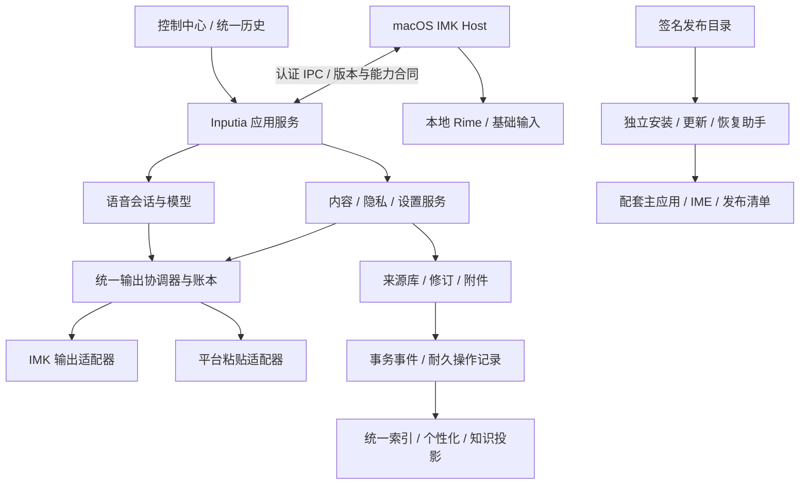

# Inputia

**Inputia 是一个以本地处理为主的桌面输入产品，将中文输入法、语音输入、剪贴板历史与知识检索放在同一套工作流中。** 它基于 [Handy](https://github.com/cjpais/Handy) 的语音能力，结合 macOS 原生输入法、Rime 和 Rust 内容服务。Handy 保留为上游名称及内部兼容标识，用户面对的产品名称统一为 Inputia。

**当前状态（2026-09-30）：已有本机安装并验证的 1.1.0/build84 双组件版本，尚未完成面向公众的 Developer ID 签名、公证和独立分发验收。** 用户已批准 P0–P6 长期架构实施，源码改造正在进行；进展与实测证据见[实施记录](docs/verification/2026-09-30-launch-architecture-execution.md)。提交代码不代表发布安装包或开放更新渠道。

导航：[当前能力](#inputia-current) · [组件与代码职责](#inputia-components) · [长期架构](#inputia-architecture) · [实施阶段](#inputia-roadmap) · [开发与文档](#inputia-development) · [上游资料](#upstream-handy)

<a id="inputia-current"></a>

## 当前能力与发布边界

| 能力            | 已有实现                                                                                      | 仍需补齐的证据或边界                                                             |
| --------------- | --------------------------------------------------------------------------------------------- | -------------------------------------------------------------------------------- |
| 中文输入法      | 原生 IMK Host、Rime、候选窗、个性化排序、个人词召回、分段整词学习、上下文与应用偏好、语境拒绝 | 新召回、分段学习与语境拒绝仍需实体键盘验收；固定语料通过不代表日常输入准确率提升 |
| 语音输入        | 本地录音与识别、后台语音服务、配对 IPC、目标令牌、输出账本                                    | 继续统一兼容输出路径，补齐焦点变化、组合输入、进程中断与结果不确定场景           |
| 统一历史        | 语音文本与录音、剪贴文本/图片/文件、搜索筛选、收藏置顶、编辑修订、复制与插入                  | 统一附件清理、跨存储删除/遗忘、崩溃恢复及兼容回滚                                |
| 知识库与外部 AI | 本地文本类文件及授权历史检索；外部 AI 默认关闭、默认只读，通过 `status/search/read` 访问      | 当前文件检索是有界关键词检索；PDF、DOCX、OCR 和自动向量 RAG 不属于现有能力       |
| 安装与更新      | 主应用与 IME 配对构建、身份校验及本地双组件更新                                               | 无开发环境依赖的安装器、持久恢复助手、Apple 公证、自有渠道和干净机验收           |

现状和验证入口见 [当前开发状态](docs/CURRENT_STATUS.md)、[候选智能化验证](docs/verification/2026-09-30-candidate-intelligence.md)、[候选面板与安装记录](docs/verification/2026-09-30-candidate-panel-width.md)。带日期的记录保留当时事实，不代表后续版本自动通过同样验收。

首次公开分发目标是 **Apple Silicon macOS**；现有配置的 macOS 13 下限仍须实际支持矩阵验证。仓库保留上游跨平台代码，但完整 Inputia 三能力融合的 Intel、Windows、Linux 支持须分别取得实现和验收证据。当前没有在此宣布可供公众安装的 Inputia 公证包；下方上游 Handy 下载地址只用于上游产品。

数据以本地保存为主。外部 AI 连接需要显式启用与授权，本地识别失败不应自动转发到远程服务。Rime 自身用户词典与 Inputia 个性化层各有生命周期；关闭或遗忘 Inputia 个性化不等于清空 Rime 原生词典。

<a id="inputia-components"></a>

## 组件与代码职责

Inputia 保留两个常驻组件：控制中心与后台应用服务，以及 macOS 独立注册的输入法 Host。关闭控制中心窗口可继续提供后台能力；显式退出语音服务应被尊重。安装/更新助手仅在安装、维护或恢复时运行。

| 边界         | 职责                                                 | 当前代码入口                                                                                                                                  |
| ------------ | ---------------------------------------------------- | --------------------------------------------------------------------------------------------------------------------------------------------- |
| 控制中心     | 设置、统一历史、知识检索、模型与状态展示             | [`src/`](src/)、[`src-tauri/src/`](src-tauri/src/)                                                                                            |
| IMK Host     | 键事件、组合输入、候选窗、目标字段身份、离线基础输入 | [`macos/InputiaInputMethod/`](macos/InputiaInputMethod/)、[`crates/inputia-rime/`](crates/inputia-rime/)                                      |
| 内容与个性化 | 历史来源、修订、学习、撤销/遗忘、检索投影与输出账本  | [`crates/inputia-handy-runtime/`](crates/inputia-handy-runtime/)                                                                              |
| 配对与通信   | 本机同用户认证、组件身份、协议与 profile 隔离        | [`native/unified-pair-auth/`](native/unified-pair-auth/)、runtime wire 模块                                                                   |
| 构建与更新   | 成套构建、本地更新和回归参考；后续演进为独立更新核心 | [`scripts/build-inputia-release.sh`](scripts/build-inputia-release.sh)、[`update-candidate.py`](macos/InputiaInputMethod/update-candidate.py) |

长期约束是：前端不直接写 SQLite，Host 不直接写主应用历史库，同一领域只有一个持久化写者；普通按键的同步处理不等待数据库、IPC 或模型推理。服务离线时保留基础键入能力，不能让内容服务故障拖住用户输入。

<a id="inputia-architecture"></a>

## 长期架构设计：四项上线工作

以下是**已批准、正在分阶段实施**的目标架构。现有模块将按阶段复用和完善，图中的统一协调、恢复和发布能力不能视为全部已经实现。完整决策、接口与失败语义见 [长期架构与上线计划](docs/codex-plans/20260930-191324-inputia.md)。



### 1. 统一输出、数据所有权与遗忘

所有语音快捷键、菜单、历史插入及兼容粘贴统一生成带操作 ID、内容修订、目标令牌、profile 和策略版本的输入意图。输出协调器先持久化唯一执行权，再选择 IMK 或平台粘贴路径；目标令牌覆盖应用实例、窗口/字段及激活代数，派发前重新校验。目标失效、组合输入冲突或权限丢失时保留文本，等待用户明确的新插入动作。

结果至少区分准备、已取得输出权、已派发、已确认、等待目标、失败和不确定。系统调用返回不能直接显示为“文本已进入目标字段”；可能已经派发但回执丢失时不自动重放或切换输出路径。目标是可确认场景至多一次，未知场景可找回结果，避免重复插入。剪贴板事务保留多格式，并保护用户期间新复制的内容。

数据继续由语音、剪贴等来源 manager 各自写入，通过本地事务内的 outbox 事件同步索引与学习。跨库操作采用耐久日志和幂等消费，记录“请求→来源变更→投影撤销→附件处理→完成”；启动恢复未完成动作。删除/遗忘先写撤销屏障并推进策略版本，旧队列不得重新导入已遗忘内容。Host 收到推送即丢弃旧个性化快照；断线租约最长 2 秒，过期退回基础输入。

附件服务统一校验、提交、引用与清理，仅清理产品受管且没有保留引用的文件；用户外部文件只移除引用。备份包含一致性数据库快照、附件、设置、修订和隐私账本，维护期间停止清理。设置采用版本化请求与生效回执，界面区分保存成功、等待组件、已生效及需重启。遗忘完成须等待受影响读者确认或租约失效及各领域处理结束，部分失败明确可见。

### 2. 独立安装、持久恢复与兼容回滚

首发目标交付签名公证 DMG，包含图形安装器与离线程序 payload；安装器内置编译好的校验、输入源注册和恢复助手，用户无需 Xcode、Python、Swift 编译器、Homebrew 或源码。新装采用每用户完整套件，安装收据绑定准确路径、UID、profile 与成套版本；既有系统级主应用通过专门迁移处理，避免影响其他 macOS 账号。

现有 Python 更新器作为已测行为参考，逐步提取 Rust 更新核心并配合原生 macOS helper。新装、修复、升级、卸载使用同一核心与清单。卸载默认保留数据；数据清除是明确的单独选择。

更新按“下载→验签→暂存→维护屏障→备份→替换→配对校验→激活→提交”执行，每个文件操作前后写入可恢复日志并持久化。两组件可能跨卷，恢复保证最终完整旧套或新套；不能宣称跨卷替换一次原子完成。恢复 bootstrap、助手版本槽和事务日志位于组件替换目录之外，自身升级保留旧槽及独立修复入口；断电、强制退出或半包状态都必须能继续恢复。

回滚程序必须被真实验证为能安全**读取、写入、消费当前事件并保留删除/遗忘语义**。更新后新增或修改的记录继续保留，不能覆盖旧备份冒充回滚。数据库演进采用扩展、兼容读写、观察、再收缩；无法安全回滚则进入可诊断修复及只读导出，禁止恢复正常写入。首个公开候选前必须备好实际签名且已演练的兼容回滚制品。

### 3. 稳定身份、签名公证与自有渠道

产品/bundle/输入源身份、每次制品的 `release_id`、渠道、每用户 installation/profile 分开管理。换版本或渠道不随意改变数据位置与 macOS 权限身份；公共制品不得嵌入开发机 profile。IPC 明确协议主次版本、能力交集与配对身份，破坏性升级先发布桥接版本。

计划新增单一产品元数据及 release manifest，生成各组件版本和构建配置，声明来源提交、组件摘要、签名身份、最低系统、协议、数据库读写范围、资源许可证、更新器合同和已验回滚目标。Apple Developer ID/公证、发布目录签名和运行时配对签名分别承担分发、更新与组件信任职责，密钥用途分离。

本机测试证书转 Developer ID 通过一次性受限桥接授权和相同事务更新器完成。权限需重新授予时明确提示；不能放宽全部身份校验，也不能修改 TCC 数据库。发布流程固定为：冻结源码与依赖→构建→签名并公证 payload→生成外置配对清单→封装并公证安装器/DMG→最终摘要与发布清单→绑定验收报告→授权发布。

菜单、控制中心和安装器使用同一 `UpdateService` 与配对更新核心，禁止单独更新 Tauri 主应用造成混装。自有下载与更新元数据可先由 GitHub Releases 静态分发，具体公开入口随正式发布建立。签名 feed 有渠道序号、有效期与密钥轮换机制；候选通过后 stable 指向**同一已验制品**，不重新构建或重签。检查失败显示“无法检查”，已安装离线功能继续可用。

### 4. 绑定最终制品的真实验收

每次发布建立机器可读验收账本，记录案例、状态、证据等级、系统/芯片/模型、源码提交、最终制品摘要及可继承的旧证据。单元测试、模拟 UI、原生 API、实体键盘/麦克风和干净机安装分别记录；`BLOCKED`、`NOT_RUN`、跳过 GUI 均不算通过。以下数值是待实施的门槛，不是已经获得的成绩。

| 验收范围         | 关键门槛                                                                                                                               |
| ---------------- | -------------------------------------------------------------------------------------------------------------------------------------- |
| 来源、合同与数据 | 所有组件对应同一固定提交；协议 N/N-1 和能力兼容；5 万混合记录、附件、重复迁移及事务边界故障后无丢失或重复学习                          |
| 输出与原生链路   | 重复/丢回执/重连 100 轮；TextEdit、浏览器、Electron 各至少 20 轮键入/语音/召回与 10 轮焦点变化；无错框、二次自动插入或静默丢键         |
| 候选与语音质量   | 真实 Rime 代表语料、训练评估分离；至少 60 条术语和 40 条普通许可音频，普通组 CER/WER 绝对恶化不超过 1 个百分点，指定“未说词”反例零插入 |
| 性能             | 1 万按键，普通键新增延迟 p95≤5ms/p99≤15ms；特殊召回 p95≤100ms/p99≤200ms；5 万历史下搜索 p95≤100ms，投影 p95≤1s                         |
| 安装、更新与恢复 | 无开发工具的干净环境、支持 OS 矩阵、真实下载隔离属性；覆盖断电/kill、磁盘满、拒权、坏包、证书迁移及更新后继续写入的回滚                |
| 发布与观察       | 最终制品及下载入口摘要一致；8 小时使用/待机/恢复验证；经授权公开候选观察至少 7 天，再决定同制品稳定晋级                                |

CI 按受影响路径运行对应检查，覆盖 Rust、Swift、原生依赖、资源和发布工具；文档仅做链接、格式与合同一致性检查。发布前通过全部必需门槛，授权上传后追加真实下载与渠道验证。隐私评估和诊断不默认上传用户正文，用户时间留出集只在取得同意后本地评估。

<a id="inputia-roadmap"></a>

## 实施阶段与退出条件

**实施状态：已批准，进行中。** 以 `6a60f811` 归档提交为基线推进，各阶段只有获得对应证据后才标记完成。完整任务、文件落点与 G0–G10 门槛见 [计划第 9 节](docs/codex-plans/20260930-191324-inputia.md#9-阶段计划依赖与交付)。

| 阶段                | 交付                                                                | 退出条件                                                        |
| ------------------- | ------------------------------------------------------------------- | --------------------------------------------------------------- |
| P0 基线与合同冻结   | 源码/安装/历史证据映射、缺口表、架构决定、manifest schema、兼容矩阵 | 当前改动归属明确，来源和组件可追溯（G0）                        |
| P1 运行时与数据收口 | 兼容输出共用账本、耐久跨库操作、附件生命周期、可解释结果            | 合同、数据、输出门槛通过（G1–G3）；删除/遗忘与故障恢复不丢正文  |
| P2 身份与发布描述   | 配对 v2、运行数据身份与发布身份解耦、v1 桥接、配置单一来源          | 错误 profile/签名/协议被拒绝，v1→v2 与 N/N-1 兼容演练通过       |
| P3 独立更新与安装   | 原生安装器、持久日志、恢复助手、修复/回滚、受管卸载                 | 数据、离线本地包安装、故障注入通过；与旧更新器关键行为一致      |
| P4 公共签名与渠道   | Developer ID 制品、公证、身份迁移桥、资源声明、自有入口             | 身份、公证及干净机安装通过；无上游错误更新路径                  |
| P5 全链路候选验收   | 最终制品验收账本、原生记录、质量和性能报告                          | G4–G7/G10a 必需案例通过，未受影响的继承证据可追溯，无未解决阻断 |
| P6 受控公开与维护   | 授权候选发布、至少 7 天观察、同制品晋级、撤回与维护手册             | 候选/稳定各完成真实下载验证（G10b），完整安装更新回滚演练通过   |

依赖顺序为 **P0 → P1/P2 → P3 → P4 → P5 → P6**。P1 与 P2 可独立并行，P3 在身份合同稳定后推进；各阶段以有界改动和具体验证报告交付。发布身份及凭据接入、真实安装身份迁移、候选上传与稳定晋级需要对应明确授权；内部接口和常规实现选择按已批准计划推进。

长期维护保留独立的产品、协议、数据库、配对清单和更新日志版本；每次发布声明直接升级来源和已测回滚目标。归档最终摘要、验收账本、资源许可证和恢复说明；公钥轮换、证书续期、索引重建、用户导出/遗忘及上游依赖更新都要有明确操作流程。撤回问题版本停止发放该更新，已安装的离线功能继续可用。

<a id="inputia-development"></a>

## 开发与文档入口

- [当前状态与现有验证](docs/CURRENT_STATUS.md)：现有产品事实、能力与待验边界。
- [完整长期架构与上线计划](docs/codex-plans/20260930-191324-inputia.md)：12 个章节，覆盖接口、失败语义、数据、安装恢复、发布与验收。
- [设置跨进程保存恢复](docs/architecture/control-settings-durability.md)：原请求耐久记录、三文件归属、启动接线与界面生效合同；App 协议接线仍在实施。
- [计划执行顺序](docs/codex-plans/plan-order.md)：已有计划登记与实施关系。
- [macOS 输入法开发](macos/InputiaInputMethod/README.md)、[构建说明](BUILD.md)：原生组件与上游构建要求。
- [本机发布流程记录](docs/verification/2026-09-27-inputia-release.md)：已有配对构建与升级证据，未宣称完成公众公证分发。
- [贡献说明](CONTRIBUTING.md)、[翻译贡献](CONTRIBUTING_TRANSLATIONS.md)、[许可证](LICENSE)：保留上游要求与署名。

```bash
bun install
bun run dev          # 控制中心前端开发
bun run tauri dev    # Tauri 应用开发；macOS 原生输入法另见其开发文档
bun run build        # TypeScript 与 Vite 构建
bun run lint
bun run check:translations
```

需要的模型与平台依赖按 [BUILD.md](BUILD.md) 准备。当前开发命令不等同于未来公开安装器；普通用户安装路径将在 P3–P4 完成验证后提供。

<a id="upstream-handy"></a>

## 上游 Handy 资料

以下保留上游 Handy 的产品背景、跨平台安装/开发说明、故障排查和贡献资料。**其中的下载、Homebrew/winget、社区、路线图和签名说明适用于上游 Handy，不是 Inputia 的公开发布或双组件更新入口。** Inputia 的现状、支持范围与实施安排以上文及完整计划为准。

[](https://discord.com/invite/WVBeWsNXK4)

**A free, open source, and extensible speech-to-text application that works completely offline.**

Handy is a cross-platform desktop application that provides simple, privacy-focused speech transcription. Press a shortcut, speak, and have your words appear in any text field. This happens on your own computer without sending any information to the cloud.

## Why Handy?

Handy was created to fill the gap for a truly open source, extensible speech-to-text tool. As stated on [handy.computer](https://handy.computer):

- **Free**: Accessibility tooling belongs in everyone's hands, not behind a paywall
- **Open Source**: Together we can build further. Extend Handy for yourself and contribute to something bigger
- **Private**: Your voice stays on your computer. Get transcriptions without sending audio to the cloud
- **Simple**: One tool, one job. Transcribe what you say and put it into a text box

Handy isn't trying to be the best speech-to-text app—it's trying to be the most forkable one.

## How It Works

1. **Press** a configurable keyboard shortcut: hold it to record and release to stop, or tap it to toggle recording on and off (Hold-only and Toggle-only modes are also available)
2. **Speak** your words while the shortcut is active
3. **Release** and Handy processes your speech using Whisper
4. **Get** your transcribed text pasted directly into whatever app you're using

The process is entirely local:

- Silence is filtered using VAD (Voice Activity Detection) with Silero
- Transcription uses your choice of models:
  - **Whisper models** (Small/Medium/Turbo/Large) with GPU acceleration when available
  - **Parakeet V3** - CPU-optimized model with excellent performance and automatic language detection
- Works on Windows, macOS, and Linux

## Quick Start

### Installation

1. Download the latest release from the [releases page](https://github.com/cjpais/Handy/releases) or the [website](https://handy.computer)
   - **macOS**: Also available via [Homebrew cask](https://formulae.brew.sh/cask/handy): `brew install --cask handy`
   - **Windows**: Also available via [winget](https://github.com/microsoft/winget-pkgs): `winget install cjpais.Handy` \
     **Note:** The Homebrew cask and winget package are not maintained by the Handy developers.
2. Install the application
3. Launch Handy and grant necessary system permissions (microphone, accessibility)
4. Configure your preferred keyboard shortcuts in Settings
5. Start transcribing!

### Development Setup

For detailed build instructions including platform-specific requirements, see [BUILD.md](BUILD.md).

## Integrations

<a href="https://www.raycast.com/mattiacolombomc/handy" title="Install Handy Raycast Extension"></a>

Control Handy from [Raycast](https://www.raycast.com) — start/stop recording, browse transcript history, manage dictionary, switch models and languages.

[Source](https://github.com/mattiacolombomc/raycast-handy) · by [@mattiacolombomc](https://github.com/mattiacolombomc)

## Architecture

Handy is built as a Tauri application combining:

- **Frontend**: React + TypeScript with Tailwind CSS for the settings UI
- **Backend**: Rust for system integration, audio processing, and ML inference
- **Core Libraries**:
  - `transcribe-cpp`: Local speech recognition with Whisper-family models (GGML/GGUF)
  - `transcribe-rs`: CPU-optimized speech recognition with Parakeet models
  - `cpal`: Cross-platform audio I/O
  - `vad-rs`: Voice Activity Detection
  - `rdev`: Global keyboard shortcuts and system events
  - `rubato`: Audio resampling

### Debug Mode

Handy includes an advanced debug mode for development and troubleshooting. Access it by pressing:

- **macOS**: `Cmd+Shift+D`
- **Windows/Linux**: `Ctrl+Shift+D`

### CLI Parameters

Handy supports command-line flags for controlling a running instance and customizing startup behavior. These work on all platforms (macOS, Windows, Linux).

**Remote control flags** (sent to an already-running instance via the single-instance plugin):

```bash
handy --toggle-transcription    # Toggle recording on/off
handy --toggle-post-process     # Toggle recording with post-processing on/off
handy --cancel                  # Cancel the current operation
```

**Startup flags:**

```bash
handy --start-hidden            # Start without showing the main window
handy --no-tray                 # Start without the system tray icon
handy --debug                   # Enable debug mode with verbose logging
handy --help                    # Show all available flags
```

Flags can be combined for autostart scenarios:

```bash
handy --start-hidden --no-tray
```

> **macOS tip:** When Handy is installed as an app bundle, invoke the binary directly:
>
> ```bash
> /Applications/Handy.app/Contents/MacOS/Handy --toggle-transcription
> ```

## Known Issues & Current Limitations

This project is actively being developed and has some [known issues](https://github.com/cjpais/Handy/issues). We believe in transparency about the current state:

### Bluetooth Headset Microphones (macOS)

Using a Bluetooth headset microphone on macOS may temporarily reduce playback quality or volume while recording because Bluetooth switches to bidirectional audio. Keep your headphones as the output device and select your Mac's built-in or an external microphone in Handy to avoid this.

### fn and Globe Key Shortcuts (macOS)

Shortcuts that include the `fn` (Globe) key **only work on Apple keyboards** — your Mac's built-in keyboard or an Apple external keyboard. They will never trigger on a third-party keyboard, even while it is connected to the same Mac.

This is a hardware limitation rather than a Handy bug. `fn` is not part of the standard USB HID keyboard specification: Apple reports it through a vendor-specific usage that macOS honors only from Apple devices, while third-party keyboards handle their `Fn` key entirely in firmware and send nothing to the computer. There is no event for Handy to listen for.

If you switch between a MacBook keyboard and an external one, pick a shortcut built from standard modifiers (`ctrl`, `option`, `shift`, `command`) or a regular key instead.

### Major Issues (Help Wanted)

**Whisper Model Crashes:**

- Whisper models crash on certain system configurations (Windows and Linux)
- Does not affect all systems - issue is configuration-dependent
  - If you experience crashes and are a developer, please help to fix and provide debug logs!

**Wayland Support (Linux):**

- Limited support for Wayland display server
- Requires [`wtype`](https://github.com/atx/wtype) or [`dotool`](https://sr.ht/~geb/dotool/) for text input to work correctly (see [Linux Notes](#linux-notes) below for installation)

### Linux Notes

**Text Input Tools:**

For reliable text input on Linux, install the appropriate tool for your display server:

| Display Server | Recommended Tool | Install Command                                    |
| -------------- | ---------------- | -------------------------------------------------- |
| X11            | `xdotool`        | `sudo apt install xdotool`                         |
| Wayland        | `wtype`          | `sudo apt install wtype`                           |
| Both           | `dotool`         | `sudo apt install dotool` (requires `input` group) |

- **X11**: Install `xdotool` for both direct typing and clipboard paste shortcuts
- **Ubuntu 26.04**: Has Wayland display server by default. `wtype` does not work, you need to install `ydotool` and configure systemd as described [here](https://github.com/cjpais/Handy/pull/557#issuecomment-3781249267).
- **Wayland**: Install `wtype` (preferred) or `dotool` for text input to work correctly
- **dotool setup**: Requires adding your user to the `input` group: `sudo usermod -aG input $USER` (then log out and back in)

Without these tools, Handy falls back to enigo which may have limited compatibility, especially on Wayland.

**Other Notes:**

- **Runtime library dependency (`libgtk-layer-shell.so.0`)**:
  - Handy links `gtk-layer-shell` on Linux. If startup fails with `error while loading shared libraries: libgtk-layer-shell.so.0`, install the runtime package for your distro:

    | Distro        | Package to install    | Example command                        |
    | ------------- | --------------------- | -------------------------------------- |
    | Ubuntu/Debian | `libgtk-layer-shell0` | `sudo apt install libgtk-layer-shell0` |
    | Fedora/RHEL   | `gtk-layer-shell`     | `sudo dnf install gtk-layer-shell`     |
    | Arch Linux    | `gtk-layer-shell`     | `sudo pacman -S gtk-layer-shell`       |

  - For building from source on Ubuntu/Debian, you may also need `libgtk-layer-shell-dev`.

- The recording overlay is disabled by default on Linux (`Overlay Position: None`) because certain compositors treat it as the active window. When the overlay is visible it can steal focus, which prevents Handy from pasting back into the application that triggered transcription. If you enable the overlay anyway, be aware that clipboard-based pasting might fail or end up in the wrong window.
- If you are having trouble with the app, running with the environment variable `WEBKIT_DISABLE_DMABUF_RENDERER=1` may help
- If Handy fails to start reliably on Linux, see [Troubleshooting → Linux Startup Crashes or Instability](#linux-startup-crashes-or-instability).
- **Global keyboard shortcuts (Wayland):** On Wayland, system-level shortcuts must be configured through your desktop environment or window manager. Use the [CLI flags](#cli-parameters) as the command for your custom shortcut.

  **GNOME:**
  1. Open **Settings > Keyboard > Keyboard Shortcuts > Custom Shortcuts**
  2. Click the **+** button to add a new shortcut
  3. Set the **Name** to `Toggle Handy Transcription`
  4. Set the **Command** to `handy --toggle-transcription`
  5. Click **Set Shortcut** and press your desired key combination (e.g., `Super+O`)

  **KDE Plasma:**
  1. Open **System Settings > Shortcuts > Custom Shortcuts**
  2. Click **Edit > New > Global Shortcut > Command/URL**
  3. Name it `Toggle Handy Transcription`
  4. In the **Trigger** tab, set your desired key combination
  5. In the **Action** tab, set the command to `handy --toggle-transcription`

  **Sway / i3:**

  Add to your config file (`~/.config/sway/config` or `~/.config/i3/config`):

  ```ini
  bindsym $mod+o exec handy --toggle-transcription
  ```

  **Hyprland:**

  Add to your config file (`~/.config/hypr/hyprland.conf`):

  ```ini
  bind = $mainMod, O, exec, handy --toggle-transcription
  ```

- You can also trigger Handy externally via Unix signals or the CLI flags, which lets Wayland window managers or other hotkey daemons keep ownership of keybindings:

  | Action                                    | Trigger                                                  |
  | ----------------------------------------- | -------------------------------------------------------- |
  | Toggle transcription                      | `pkill -USR2 -n handy` or `handy --toggle-transcription` |
  | Toggle transcription with post-processing | `handy --toggle-post-process`                            |

  Example Sway config:

  ```ini
  bindsym $mod+o exec pkill -USR2 -n handy
  bindsym $mod+p exec handy --toggle-post-process
  ```

  `pkill` here simply delivers the signal—it does not terminate the process.

  > **Behavior change:** older releases also accepted `SIGUSR1` for toggling transcription with post-processing. WebKitGTK — the webview engine embedded in Handy on Linux — uses SIGUSR1 internally to coordinate JavaScript garbage collection, so listening for it caused phantom recordings and interrupted dictations every few minutes ([#1660](https://github.com/cjpais/Handy/issues/1660)). Handy no longer listens for SIGUSR1 on Linux; the post-processing toggle is still available via `handy --toggle-post-process`. **Remove any `pkill -USR1` bindings**: the signal is now delivered straight to WebKit's internal handler and can crash the app.

**Overlay & Pasting Issues (Linux):**

- The recording overlay window can interfere with pasting transcribed text into target applications on Linux (X11)
- **Solution:** Open **Settings > Advanced** and set **"Overlay Position"** to **"None"** to disable the overlay
- Enable **"Audio Feedback"** (also in Advanced) if you still want audible confirmation of recording state
- Users who upgrade from older versions or import settings from other platforms may need to manually apply this change

### Platform Support

- **macOS (both Intel and Apple Silicon)**
- **x64 Windows**
- **x64 Linux**

### System Requirements/Recommendations

The following are recommendations for running Handy on your own machine. If you don't meet the system requirements, the performance of the application may be degraded. We are working on improving the performance across all kinds of computers and hardware.

**For Whisper Models:**

- **macOS**: M series Mac, Intel Mac
- **Windows**: Intel, AMD, or NVIDIA GPU
- **Linux**: Intel, AMD, or NVIDIA GPU
  - Ubuntu 22.04, 24.04

**For Parakeet V3 Model:**

- **CPU-only operation** - runs on a wide variety of hardware
- **Minimum**: Intel Skylake (6th gen) or equivalent AMD processors
- **Performance**: ~5x real-time speed on mid-range hardware (tested on i5)
- **Automatic language detection** - no manual language selection required

## Roadmap & Active Development

We're actively working on several features and improvements. Contributions and feedback are welcome!

### In Progress

**Debug Logging:**

- Adding debug logging to a file to help diagnose issues

**macOS Keyboard Improvements:**

- Support for Globe key as transcription trigger
- A rewrite of global shortcut handling for MacOS, and potentially other OS's too.

**Opt-in Analytics:**

- Collect anonymous usage data to help improve Handy
- Privacy-first approach with clear opt-in

**Settings Refactoring:**

- Cleanup and refactor settings system which is becoming bloated and messy
- Implement better abstractions for settings management

**Tauri Commands Cleanup:**

- Abstract and organize Tauri command patterns
- Investigate tauri-specta for improved type safety and organization

## Verify Release Signatures

Handy release artifacts are signed with Tauri's updater signature format. The public key is stored in [`src-tauri/tauri.conf.json`](src-tauri/tauri.conf.json) under `plugins.updater.pubkey`.

To verify a release manually, set `ARTIFACT` to the filename you downloaded, save the `pubkey` value from `src-tauri/tauri.conf.json` to `handy.pub.b64`, then decode the public key and matching `.sig` file from base64 and verify the artifact with `minisign`:

```bash
# Replace with the file you downloaded
ARTIFACT="Handy_0.8.1_amd64.AppImage"

python3 - "$ARTIFACT" <<'PY'
import base64, pathlib, sys

artifact = sys.argv[1]

pub = pathlib.Path("handy.pub.b64").read_text().strip()
pathlib.Path("handy.pub").write_bytes(base64.b64decode(pub))

sig = pathlib.Path(f"{artifact}.sig").read_text().strip()
pathlib.Path(f"{artifact}.minisig").write_bytes(base64.b64decode(sig))
PY

minisign -Vm "$ARTIFACT" \
  -p handy.pub \
  -x "$ARTIFACT.minisig"
```

On success, `minisign` prints:

```text
Signature and comment signature verified
```

Do not use `gpg` for these `.sig` files.

## Troubleshooting

### Manual Model Installation (For Proxy Users or Network Restrictions)

If you're behind a proxy, firewall, or in a restricted network environment where Handy cannot download models automatically, you can manually download and install them. The URLs are publicly accessible from any browser.

#### Step 1: Find Your App Data Directory

1. Open Handy settings
2. Navigate to the **About** section
3. Copy the "App Data Directory" path shown there, or use the shortcuts:
   - **macOS**: `Cmd+Shift+D` to open debug menu
   - **Windows/Linux**: `Ctrl+Shift+D` to open debug menu

The typical paths are:

- **macOS**: `~/Library/Application Support/com.pais.handy/`
- **Windows**: `C:\Users\{username}\AppData\Roaming\com.pais.handy\`
- **Linux**: `~/.config/com.pais.handy/`

#### Step 2: Create Models Directory

Inside your app data directory, create a `models` folder if it doesn't already exist:

```bash
# macOS/Linux
mkdir -p ~/Library/Application\ Support/com.pais.handy/models

# Windows (PowerShell)
New-Item -ItemType Directory -Force -Path "$env:APPDATA\com.pais.handy\models"
```

#### Step 3: Download Model Files

Download the models you want from below

**Whisper Models (single .bin files):**

- Small (487 MB): `https://blob.handy.computer/ggml-small.bin`
- Medium (492 MB): `https://blob.handy.computer/whisper-medium-q4_1.bin`
- Turbo (1600 MB): `https://blob.handy.computer/ggml-large-v3-turbo.bin`
- Large (1100 MB): `https://blob.handy.computer/ggml-large-v3-q5_0.bin`

**Parakeet Unified EN 0.6B (single `.gguf` file, recommended):**

- Q8_0 (731 MB): `https://huggingface.co/handy-computer/parakeet-unified-en-0.6b-gguf/resolve/main/parakeet-unified-en-0.6b-Q8_0.gguf`

**Parakeet Models (compressed archives):**

- V2 (473 MB): `https://blob.handy.computer/parakeet-v2-int8.tar.gz`
- V3 (478 MB): `https://blob.handy.computer/parakeet-v3-int8.tar.gz`

#### Step 4: Install Models

**For Whisper Models (.bin files):**

Simply place the `.bin` file directly into the `models` directory:

```
{app_data_dir}/models/
├── ggml-small.bin
├── whisper-medium-q4_1.bin
├── ggml-large-v3-turbo.bin
└── ggml-large-v3-q5_0.bin
```

**For GGUF Models (.gguf files):**

Place the `.gguf` file directly into the `models` directory, exactly like the Whisper `.bin` files above. Handy also picks up models already present in the shared Hugging Face cache (`~/.cache/huggingface/hub`), so a copy downloaded by another tool works without being moved.

**For Parakeet Models (.tar.gz archives):**

1. Extract the `.tar.gz` file
2. Place the **extracted directory** into the `models` folder
3. The directory must be named exactly as follows:
   - **Parakeet V2**: `parakeet-tdt-0.6b-v2-int8`
   - **Parakeet V3**: `parakeet-tdt-0.6b-v3-int8`

Final structure should look like:

```
{app_data_dir}/models/
├── parakeet-tdt-0.6b-v2-int8/     (directory with model files inside)
│   ├── (model files)
│   └── (config files)
└── parakeet-tdt-0.6b-v3-int8/     (directory with model files inside)
    ├── (model files)
    └── (config files)
```

**Important Notes:**

- For Parakeet models, the extracted directory name **must** match exactly as shown above
- Do not rename the `.bin` or `.gguf` files—use the exact filenames from the download URLs
- After placing the files, restart Handy to detect the new models

#### Step 5: Verify Installation

1. Restart Handy
2. Open Settings → Models
3. Your manually installed models should now appear as "Downloaded"
4. Select the model you want to use and test transcription

### Custom Whisper Models

Handy can auto-discover custom Whisper GGML models placed in the `models` directory. This is useful for users who want to use fine-tuned or community models not included in the default model list.

**How to use:**

1. Obtain a Whisper model in GGML `.bin` format (e.g., from [Hugging Face](https://huggingface.co/models?search=whisper%20ggml))
2. Place the `.bin` file in your `models` directory (see paths above)
3. Restart Handy to discover the new model
4. The model will appear in the "Custom Models" section of the Models settings page

**Important:**

- Community models are user-provided and may not receive troubleshooting assistance
- The model must be a valid Whisper GGML format (`.bin` file)
- Model name is derived from the filename (e.g., `my-custom-model.bin` → "My Custom Model")

### Linux Startup Crashes or Instability

If Handy fails to start reliably on Linux — for example, it crashes shortly after launch, never shows its window, or reports a Wayland protocol error — try the steps below in order.

**1. Install (or reinstall) `gtk-layer-shell`**

Handy uses `gtk-layer-shell` for its recording overlay and links against it at runtime. A missing or broken installation is the most common cause of startup failures and can manifest as a crash or a hang well before any window is shown. Make sure the runtime package is installed for your distro:

| Distro        | Package to install    | Example command                        |
| ------------- | --------------------- | -------------------------------------- |
| Ubuntu/Debian | `libgtk-layer-shell0` | `sudo apt install libgtk-layer-shell0` |
| Fedora/RHEL   | `gtk-layer-shell`     | `sudo dnf install gtk-layer-shell`     |
| Arch Linux    | `gtk-layer-shell`     | `sudo pacman -S gtk-layer-shell`       |

If it is already installed and you still see startup problems, try reinstalling it (e.g. `sudo pacman -S gtk-layer-shell` again) in case the library files were corrupted by a partial upgrade.

**2. Disable the GTK layer shell overlay (`HANDY_NO_GTK_LAYER_SHELL`)**

If installing the library does not help, you can skip `gtk-layer-shell` initialization entirely as a workaround. On some compositors (notably KDE Plasma under Wayland) it has been reported to interact poorly with the recording overlay. With this variable set, the overlay falls back to a regular always-on-top window:

```bash
HANDY_NO_GTK_LAYER_SHELL=1 handy
```

**3. Disable WebKit DMA-BUF renderer (`WEBKIT_DISABLE_DMABUF_RENDERER`)**

On some GPU/driver combinations the WebKitGTK DMA-BUF renderer can cause the window to fail to render or to crash. Try:

```bash
WEBKIT_DISABLE_DMABUF_RENDERER=1 handy
```

**Making a workaround permanent**

Once you've found a flag that helps, export it from your shell profile (`~/.bashrc`, `~/.zshenv`, …) or from the desktop autostart entry that launches Handy. If you launch Handy from a `.desktop` file, you can prefix the `Exec=` line, e.g.:

```ini
Exec=env HANDY_NO_GTK_LAYER_SHELL=1 handy
```

If a workaround helps you, please [open an issue](https://github.com/cjpais/Handy/issues) describing your distro, desktop environment, and session type — that information helps us narrow down the underlying bug.

### Handy Starts or Stops Recording on Its Own (Linux)

Handy 0.9.4 and earlier listened for `SIGUSR1` as a remote-control trigger. WebKitGTK — the webview engine embedded in Handy on Linux — uses that same signal internally to coordinate JavaScript garbage collection, so GC cycles were misread as hotkey presses: recordings started on their own, or real dictations were cut off mid-sentence (typically ~2 minutes in). See [#1660](https://github.com/cjpais/Handy/issues/1660).

Update to a newer release, and replace any `pkill -USR1 -n handy` keybindings with `handy --toggle-post-process`.

### How to Contribute

1. **Check existing issues** at [github.com/cjpais/Handy/issues](https://github.com/cjpais/Handy/issues)
2. **Fork the repository** and create a feature branch
3. **Test thoroughly** on your target platform
4. **Submit a pull request** with clear description of changes
5. **Join the discussion** - reach out at [contact@handy.computer](mailto:contact@handy.computer)

The goal is to create both a useful tool and a foundation for others to build upon—a well-patterned, simple codebase that serves the community.

## Sponsors

<div align="center">
  We're grateful for the support of our sponsors who help make Handy possible:
  <br><br>
  <a href="https://wordcab.com">
    
  </a>
  &nbsp;&nbsp;&nbsp;&nbsp;&nbsp;&nbsp;
  <a href="https://github.com/epicenter-so/epicenter">
    
  </a>
  &nbsp;&nbsp;&nbsp;&nbsp;&nbsp;&nbsp;
  <a href="https://boltai.com?utm_source=handy">
    
  </a>
</div>

## Related Projects

- **[Handy CLI](https://github.com/cjpais/handy-cli)** - The original Python command-line version
- **[handy.computer](https://handy.computer)** - Project website with demos and documentation

## License

MIT License - see [LICENSE](LICENSE) file for details.

Handy is open-source software, but the Handy name, logo, icon, and brand assets are not open-source. Unofficial forks, rewrites, and redistributions must use their own branding and must not imply endorsement or affiliation.

## Acknowledgments

- **Whisper** by OpenAI for the speech recognition model
- **ggml and transcribe.cpp** for amazing cross-platform speech-to-text inference/acceleration
- **Silero** for great lightweight VAD
- **Tauri** team for the excellent Rust-based app framework
- **Community contributors** helping make Handy better
