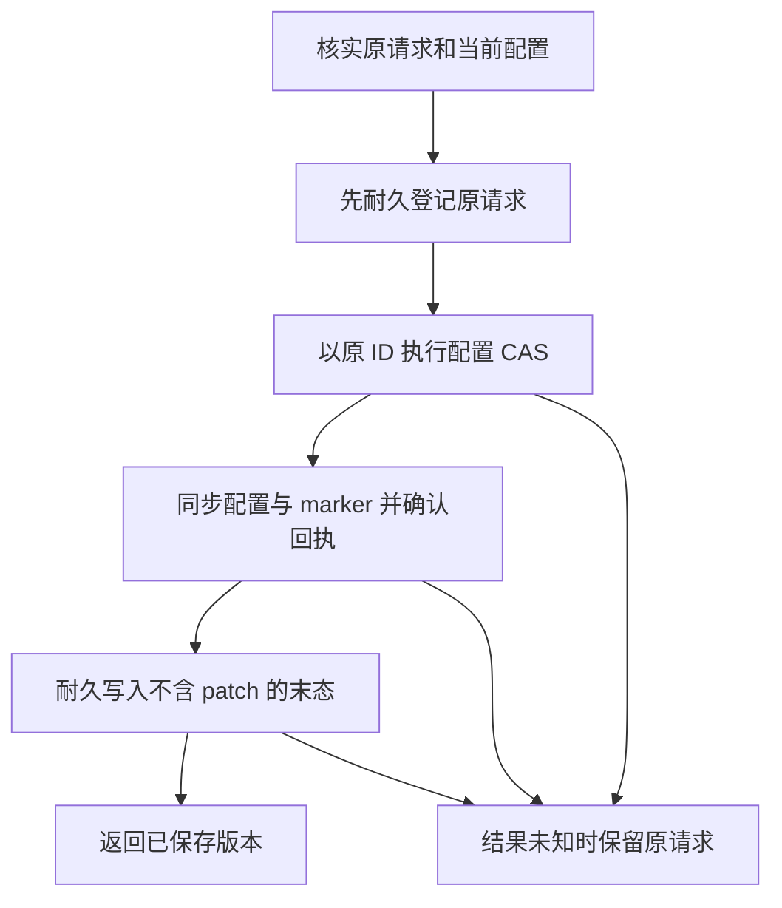

# 控制中心设置的跨进程保存恢复

状态：分批实施中。已有单进程原请求保留、CAS、准确提交快照及启动恢复。通用耐久请求核心已落代码、通过故障注入测试并完成独立局部复核；控制中心领域尚未启用新协议，仍须接入启动三文件归属、跨进程协调及界面状态。

## 需要封闭的窗口

`Coordinator` 现在会在结果不确定时保留 `PlannedChange`，阻止同进程的新请求，并按原 ID 重试。进程被杀后这份内存记录消失。配置文件中的有限回执仍然存在，但新进程没有原请求身份，无法完整说明上次保存的结果，更不能据此声明设备或快捷键已应用。

持久化恢复只处理配置 patch。模型删除、文本插入、录音提交和任意外部命令不得放入此日志，也不得随启动重新执行。

## 记录及所有权

- 日志放在配置所在安全目录，使用领域固定文件名；沿用目录 FD、同一个独立文件锁、严格 JSON、大小限制和 0600 权限。路径或领域不能由 UI 指定。
- 活动记录绑定 schema、领域、store ID、ledger UUID、原操作 ID、请求摘要和最低确认版本/值摘要，并包含恢复该配置 patch 所需的原请求。patch 可能含凭据，不能进入日志输出、事件、错误正文或通用诊断包。
- 已确认末态记录只保留操作与版本元数据，移除 patch。用耐久替换的末态记录关闭请求，避免 `unlink` 尚未同步时误以为旧请求已经永久清除。
- 不通过 JSON 制造进程内读取凭据。恢复时重新核实领域、磁盘身份、版本下限及请求摘要；错域、文件回退、丢失 marker 或未知格式保留原文件并要求恢复。

## 保存顺序

登记本身失败或不确定时不继续写配置。活动请求存在时，另一个请求、普通保存和外部导入都必须遵守同一门禁。外部导入保留原预览文件摘要，不能在重启时改用新文件预览。只有相同 ID 与相同摘要可继续对账；不得换 ID 重试。设置与日志不是多文件原子事务，每一个同步边界都要能独立重入。

结果必须区分：已保存、确定冲突、确定未写、仍未知、回执窗口已过期。未知或过期不能由一个布尔值变成成功。新请求替换末态之前必须确认旧请求已关闭；末态核验不得重新保留已经清除的凭据。Saved 末态须与真实文档回执匹配，单独日志不能证明保存成功；回执过期保留活动请求并要求处理。原正文从末态记录移除不代表物理擦除文件系统中的旧块。

## 启动与迁移

启动备份必须把配置、初始化 marker 和请求日志作为同一领域记录各自的存在/缺失及归属。恢复不能只还原配置、留下较新的请求日志，也不能依据旧日志重新创建已经消失的领域。

原配置请求的对账或幂等重放，必须发生在启动迁移已经授权修改、业务 manager 尚未启动的阶段。完成配置确认后才从当前 desired 配置初始化本次进程的组件。已有的 Prepared / Mutating / Restoring / Recovered / Completed 规则继续适用；未知归属不自动删除。

协议激活采用显式三文件升级：只接受完整旧文档与 marker，先由 observer 耐久登记原始及目标三文件的名字、摘要、大小，再复查原件及维护状态。按日志 Bootstrap、文档、marker 的顺序耐久替换。完整新协议的重复激活须重新同步全部文件；部分状态不在普通读取或再次激活中修补，交外层启动事务恢复。

文档、marker 与 ledger 共同绑定版本及 ledger UUID；快照下限也包含协议身份。新协议文档或 marker 仍在时，缺日志和错 UUID 要求恢复；已持有新协议快照的进程也会拒绝同正文/同版本的协议降级。单独核心不能识别三份文件连同外层已确认记录一起协调回退，不能宣称绝对回滚防护。核心可选启用的领域在旧协议下只允许迁移读取，普通保存与外部导入拒绝。

下一包必须把激活 intent 和配置对账产生的写入摘要纳入启动日志，覆盖原件缺失、激活后多次更新及下一次恢复。现有两文件 Creation 结构尚不满足这些条件，控制中心不能提前启用。正常运行后的挂起请求如何新建精确恢复 attempt，以及 Completed 后的重新准入仍须随接线实现并核验。

## 界面和生效状态

- 已保存仅指配置版本和持久化回执已确认。
- 已生效必须另有对应组件及版本的直接观察；其他组件的成功不能代替当前组件。
- 尚未应用或组件离线时显示等待组件；必须重建进程才能确认时显示需要重启。
- 原请求确认结果未知时，界面保留待确认状态和明确的对账动作，不重新发送一个新请求。
- 任何重试都只确认配置保存结果；不能自动冒充原生副作用已经执行。

## 必需回归

1. 日志临时写、文件同步、rename、目录同步各边界失败后，配置是否允许开始写。
2. 配置提交前后崩溃，原 ID 恢复；不产生第二个请求或重复外部副作用。
3. 配置已提交但末态替换未确认，恢复能再次核实同一提交。
4. 两个进程竞争不同请求；活动请求存在时外部导入不得越过门禁。
5. 旧配置、新日志或不同 store 的混合恢复被拒绝，原件保留。
6. 回执过期、日志损坏/重复键、链接替换、错误权限、维护状态和超限记录。
7. 启动备份对三份文件的 present/absent 矩阵，以及手工修复后重新启动不覆盖修复。
8. UI 分别显示保存、等待组件、需要重启和未确认；错误提示不包含配置值或凭据。

真实用户数据、日用安装及最终制品验收仍按总计划的授权和证据边界执行。

## 启动接线的下一批边界

现启动日志为 schema 2，`Completed` 会直接复用完成状态。新增协议不能另起一个目录跳过旧的 `Mutating` 或 `Restoring` attempt；旧恢复必须先完成或明确要求修复。旧日志不认识的新 pending 文件若已经出现，也不能只恢复两份旧文件并保留它。

新日志需要记录以下事实：

- 每个固定领域文件的原始存在状态、摘要、大小与身份；控制中心增加固定 pending 文件。
- 初始化、协议激活、原配置请求对账分别产生的写入许可。在每次源文件替换前，先耐久登记准确旧摘要与允许的新摘要；注册许可不等于写入已发生。
- 新建文件可能从 Bootstrap 继续变为 Active 和 Resolved。恢复只能隔离本 attempt 预先登记过的准确状态，不能凭 store UUID 隔离未知正文。
- 现有文件恢复前也需要核实当前字节属于原基线或已授权的变更，防止覆盖崩溃后用户手工修复的内容。
- `Completed` 后再次启动遇到原挂起请求时，需要新的受控恢复 attempt；普通启动不应每次备份全部模型与录音。具体快照范围须固定并进入 manifest 合同。

这些是接线阶段的待实现合同。当前 App 仍用原协议，不能把通用核心测试结果当成跨进程产品恢复已经上线。
