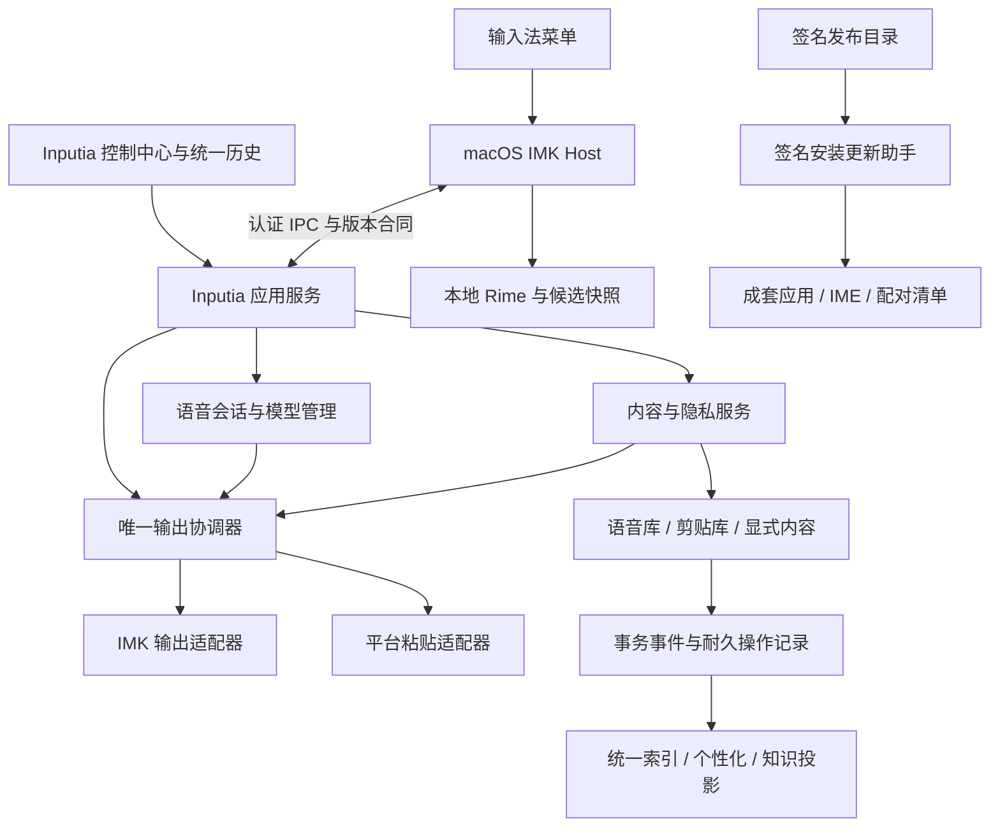
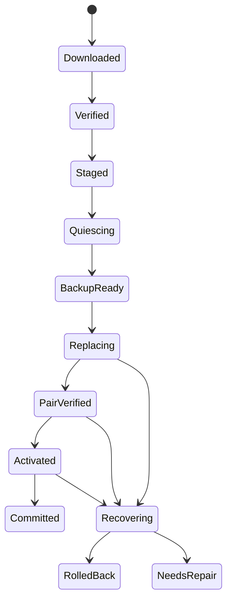

# Inputia 长期架构与上线计划

- Plan ID: `P20260930-191324`
- 登记时间(北京时间，仅规划): `2026-09-30 19:13:24 +0800`
- 项目根目录: `/Users/lzl/FILE/github/Handy-unified-input-system`
- 来源需求: 为三能力融合、独立签名安装包、自有产品发布入口、原生验收及回滚四点编写可长期使用的完善架构与实施计划；本次仅规划。

状态：**2026-09-30 用户已批准整份计划并要求以持续目标模式实施，现已开始源码改造。** 归档基线为 `6a60f811acf2dfa8c2b929323f7a5bde0ac00cf1`，此前本地改动、各分支及 stash 均已保存到 origin。文档登记时间不是实施开始时间；阶段状态与实测证据见[实施记录](../verification/2026-09-30-launch-architecture-execution.md)。证书接入、真实安装身份迁移与公开发布仍按第 11 节授权边界执行。适用产品是 Inputia 的 macOS 输入法、语音、统一历史及现有知识库。

设计复核：已完成运行时、发布和验收三个独立范围的源码核查，以及架构批判审查。审查发现的多用户组件错配、恢复助手自身存活、回滚读写/隐私语义、渠道序号与验收时序问题已修入正文；2026-09-30 限定复审通过。这是设计审查结果，不是产品实现或上线验收通过。

## 1. 基线、纠正与范围

### 1.1 以实际产品工作区为基线

| 对象                                                               | 本次核实的状态                                                                                                      | 对计划的影响                                                   |
| ------------------------------------------------------------------ | ------------------------------------------------------------------------------------------------------------------- | -------------------------------------------------------------- |
| 旧工作区 `/Users/lzl/FILE/github/Handy`                            | `codex/funasr-sherpa-native-hotwords`，`5dab8aaa`；含旧 v40 Host 与旧发布入口                                       | 上一轮审计主要检查了这里，其“融合未实现”结论不能套用到当前产品 |
| 当前产品工作区 `/Users/lzl/FILE/github/Handy-unified-input-system` | `codex/unified-input-system`，HEAD `70687eac7861c7f1c48edefe295548f875fa2d5a`，另有进行中的候选质量、构建和文档改动 | 这是实施的主线；HEAD 本身不能完整代表当前工作树或 build84      |
| 当前日用产品                                                       | `Inputia.app` 与用户级 `InputiaUnifiedCandidate.app`；当前状态入口记录 1.1.0/build84，安装元数据也已核对            | 既有品牌、profile、签名和原生体验属于迁移基线                  |
| 已有实现                                                           | 统一历史、录音/图片迁移、配对 IPC、目标 token、输出账本、个性化、集中设置和双组件本地更新                           | 复用并完善，按剩余缺口实施                                     |
| 已有发布边界                                                       | 稳定的本机测试证书、配对清单和本地构建；尚未完成 Apple 公证及公开分发                                               | 首要交付是可独立安装、可验证、可恢复的正式发布链               |

事实入口：[CURRENT_STATUS](../CURRENT_STATUS.md)、[唯一 Inputia 产品决定](../plans/2026-09-08-inputia-only-product.md)、[本机发布记录](../verification/2026-09-27-inputia-release.md)、[后台服务与身份维护](../verification/2026-09-29-background-voice-service.md)、[候选升级](../verification/2026-09-30-candidate-intelligence.md)、[最新安装记录](../verification/2026-09-30-candidate-panel-width.md)。带日期记录中的旧版本保留为历史，最新状态须与真实安装核对。

### 1.2 四个问题转成四个长期合同

| 原问题           | 修正后的工作目标                                                                    | 完成证据                                                               |
| ---------------- | ----------------------------------------------------------------------------------- | ---------------------------------------------------------------------- |
| 三能力融合       | 统一输出所有权、数据生命周期、故障语义和设置状态；收拢仍存在的兼容支路              | 所有入口经过相同策略/输出协调；删除、遗忘、断线和恢复测试通过          |
| 可分发安装包     | 在没有开发环境的 Mac 上新装、升级、重启恢复；双组件配套且经 Developer ID 签名、公证 | 下载来源真实、带隔离属性的最终制品通过干净机验收                       |
| 自有产品发布入口 | 一份版本与制品清单、一套 Inputia 文档、一条配对更新渠道                             | 页面、菜单、更新器、安装器识别同一 releaseId，禁止误投上游与单组件更新 |
| 原生验收和回滚   | 建立可复跑、有证据等级、绑定实际制品的验收体系                                      | 必需用例无 FAIL/BLOCKED/NOT_RUN；故障注入和更新后数据对账通过          |

### 1.3 首次公开版本的明确边界

- 产品名称固定为 **Inputia**。保留已有语音、输入法、剪贴历史、知识库与外部 AI 功能；外部 AI 维持默认关闭及只读边界。
- 首发发布目标为 Apple Silicon macOS。现有最低版本配置为 macOS 13；它是待矩阵验证的支持下限，不因配置存在就宣称可用。依赖更高系统版本的功能使用能力检测及明确禁用说明。
- Intel、Windows、Linux 继续维护已有共享代码的构建与行为；不在缺乏实际证据时发布“完整三能力融合已支持”声明。每新增正式支持目标都复用同一发布协议和验收合同。
- 当前生产 bundle ID、已安装路径及 `trial-20260905` 数据定位保持兼容。内部名称可长期作为兼容标识，用户界面只展示 Inputia。
- 先完成源码与制品归属登记，再形成可复现发布提交。进行中的未提交改动要逐项纳入或排除，不重置、覆盖或混入未知修改。
- 不承诺 App Store 上架、云同步、订阅账户或新增在线后台。本计划交付现有桌面产品的独立分发和长期维护能力。

## 2. 总体架构与职责



保留两个必要的常驻组件：IMK Host 负责键入、组合状态与候选窗；Inputia 主应用同时承担控制中心和后台服务。关窗继续后台工作，明确退出语音服务后不自动循环复活。更新助手仅在安装、更新或恢复期间运行，不新增常驻服务。

| 边界       | 唯一职责与所有权                                             | 现有落点 / 实施落点                                                                    |
| ---------- | ------------------------------------------------------------ | -------------------------------------------------------------------------------------- |
| IMK Host   | 原生键事件、composition、field epoch、候选展示、离线基础输入 | `macos/InputiaInputMethod/Sources/InputiaInputMethod/`                                 |
| 应用服务   | 启停、模型、输入意图、后台任务调度、对 UI 提供状态           | `src-tauri/src/lib.rs`、现有 managers、voice 相关模块                                  |
| 内容与学习 | 源事件、修订、删除/遗忘、统一查询、可撤销学习                | `crates/inputia-handy-runtime`、现有 integration/personalization 模块                  |
| 输出协调器 | 为每次输出选定唯一 owner 和目标；耐久 claim 与结果状态       | 现有 `output_ledger`、`integration_output`、`voice_dispatch`、`host_shortcut_broker`   |
| 共享合同   | 消息、能力、版本、错误、状态与时间预算                       | 先集中在现有 runtime wire/契约模块；出现真实依赖环再提取小型 `inputia-contracts` crate |
| 更新协调器 | 校验、维护屏障、备份、成套替换、恢复、启动后验收             | 复用 `update-candidate.py` 的已测策略，产品实现为预编译的原生助手                      |
| 发布工具   | 从固定源码生成、校验并晋级不可变制品                         | 复用 `scripts/build-inputia-release.sh`，新增 release manifest、feed 与 gate           |

关键约束：前端不直接写 SQLite；Host 不直接修改主应用历史库；同一聚合由一个 manager 写入；IPC、数据库、模型推理不进入普通按键的同步关键路径。跨库一致性通过可恢复事件与屏障实现，不把多文件 SQLite commit 描述成全局原子事务。

## 3. 运行时、输出与兼容合同

### 3.1 一套输入意图与输出状态

所有语音快捷键、菜单操作、历史插入和兼容粘贴均产生 `InputIntent`，其中包含 `operation_id`、来源、动作、内容稳定 ID/修订、目标能力、profile、policy epoch 与截止时间。协调器在副作用前耐久 claim，决定 IMK 或 Platform adapter，已经 claim 或回执未知后不得静默换路线。

现有 Legacy 入口服务于无可靠 Host lease 的应用，包括某些 Electron 控件，仍有实际价值。将它纳入同一个协调器和输出账本：能证明目标时自动输出；无法证明原字段时保留结果，并通过用户明确的“插入到当前输入框”触发新意图。不得仅依据应用 PID 相同就宣称回到原字段。

| 状态                                   | 允许含义                                              | 后续行为                                       |
| -------------------------------------- | ----------------------------------------------------- | ---------------------------------------------- |
| `prepared`                             | 内容、策略和目标已准备，未执行副作用                  | 可取消；过期后重新准备                         |
| `claimed`                              | 唯一输出权已持久化，副作用可能即将开始                | 不允许第二 adapter 抢占                        |
| `dispatched`                           | IMK insertText 或粘贴事件已交给系统                   | UI 显示已派发，不推断应用已接收                |
| `confirmed`                            | 对应 adapter 有直接可验证完成证据，例如剪贴板写入校验 | 保存证据类型，禁止把“调用返回”提升为正文已插入 |
| `pending_target`                       | 目标过期、不可观测或组合冲突                          | 保留可查看文本，等待明确的新目标意图           |
| `failed_before_dispatch` / `cancelled` | 可证明未派发                                          | 允许用户重新发起新 operation                   |
| `uncertain`                            | 已可能派发，但回执或进程丢失                          | 不自动重放，先让用户确认目标中是否已有内容     |

实际名称可以兼容现有 enum；状态转换语义是强制合同。稳定承诺为“可确认场景至多一次，未知不自动重放”，不承诺跨崩溃的通用 exactly-once。

### 3.2 目标、剪贴板和组合输入

- `TargetToken` 绑定应用实例、窗口/字段身份、激活代数、Host 会话和权限 epoch；记录元数据，不读取字段正文作身份标识。
- 排队前、慢准备后、最终派发前分别检查目标及截止时间。目标不明、Secure Input、权限失效时走安全的待插入状态。
- 组合输入期间保存原 composition；语音完成不得清空、覆盖或强制提交用户未完成的拼音。后续插入由可解释的排队/确认规则完成。
- 沿用现有多格式 paste transaction。恢复剪贴板时保护用户期间的新复制；无法恢复要给可见结果，不只写日志。AppKit 不提供原子 CAS 的事实体现在结果语义里。
- 录音、转写、历史保存、插入分别记录阶段：历史保存成功而插入失败，文本仍可找回；WAV 保存失败不应丢掉已成功识别文本。

### 3.3 IPC 与升级兼容

维持本机私有 socket、同用户身份、配对签名认证和有界帧。握手明确交换 `protocol_major/minor`、能力集、进程实例、profile、policy epoch 和配对 releaseId。

- minor 只加可选能力；未知可选字段可忽略。改变必需语义时升 major，旧客户端得到明确不兼容错误，基础 Rime 输入继续可用。
- 正常安装始终成对更新。协议迁移窗口支持 N 与 N-1 的桥接握手；具体能力取交集；破坏性版本必须先发布桥接版本，不宣称任意历史混装可用。
- 已认证连接可复用；权限 epoch、服务实例、配对清单、维护模式变化必须失效。完整资源验签在连接建立/身份变化时执行，不为每次键入重复全包扫描。
- idle 可等待，半帧仍受严格截止限制；大小、并发数、队列容量和取消都有上限。
- 共用错误类型：`permission_required`、`service_stopped`、`incompatible_pair`、`target_unobservable`、`deadline_exceeded`、`storage_unavailable`。UI 依据类型提供恢复动作，不通过英文字符串猜错误。

### 3.4 候选延迟与新召回交互

当前准确码个人词召回有专用 RunLoop、有重入防护、32 事件队列和最多 750ms 准入等待。这是已有的有界策略，不能仅凭等待数值断言功能错误；也不能把它当作已满足交互预算。

实施次序：先为“键事件→候选可见”“选中→提交”“Return/Tab 边界等待”分开埋点，测冷启动、大词库、语音并发和慢服务；再在保持字段/epoch/原候选身份验证的前提下优化预取与本地快照。导航后锁定数字和候选对应关系，异步排序不得让用户按 2 时选中另一个词。

发布合同是无静默丢键、无越序、无错字段。普通同步处理沿用新增开销 p95 ≤5ms、p99 ≤15ms 的目标；特殊召回等待另行报告，发布目标 p95 ≤100ms、p99 ≤200ms，750ms 仅是失败保护上限。前者与后者不能用同一平均值掩盖。超时/队列满的恢复策略必须经原生验证；若新增召回达不到门槛，先修复或明确关闭该新增路径并显示能力状态，保留既有 Rime 与异步重排。此降级不能将原定功能标记为“完成”，完整发布仍须完成验收。

## 4. 数据、隐私和生命周期

### 4.1 保持源数据和派生投影的区别

保留现有语音库、剪贴库与统一集成库的职责。每条内容有稳定身份、来源、单调修订、附件引用及策略版本；相同正文不同来源不直接合并。事件唯一键至少覆盖源实例、实体 ID、修订与动作，重放不增加学习次数。

| 数据类别                          | 权威写入方          | 删除与恢复规则                                             |
| --------------------------------- | ------------------- | ---------------------------------------------------------- |
| 当前转写/剪贴正文、收藏/标题      | 对应 source manager | 修改产生新修订及 outbox；冲突基于期望修订拒绝覆盖          |
| 历史修订、删除/遗忘屏蔽、输出账本 | 集成服务            | 是权威恢复数据，不能当普通缓存随意清空                     |
| 搜索索引、候选权重、知识检索缓存  | 投影消费者          | 可从仍被授权的源和账本重建；重建前先应用删除/遗忘          |
| WAV、图片、受管附件               | 附件生命周期服务    | 引用计数/可达性检查、保留策略和独立 GC；不删除外部用户文件 |
| Rime 用户词典                     | IMK/Rime            | 单独记录其清除能力，Inputia 忘记成功不冒充 Rime 已忘记     |

### 4.2 补齐跨库动作的耐久恢复

围绕现有 outbox、source mutation guard、revision 和 policy epoch 增强，采用可恢复的操作日志，不额外引入分布式数据库：

1. 为批量修改、删除/清空、遗忘、导入、跨库迁移写入 `operation_id` 和期望版本；危险数据在索引和学习侧立即被屏蔽。
2. 每个源库的本地事务同时写数据及 outbox。处理结果携带 cursor 和源实例，消费者幂等确认。
3. 集成日志记录 `requested → source_applied → projections_revoked → attachments_scheduled → completed`，失败记录下一步及重试类别。
4. 启动先恢复未完成动作，再接受依赖旧 epoch 的学习或输出。旧队列不能复活已删除/遗忘内容。
5. 真正遗忘与语境拒绝是不同操作；前者撤销个性化贡献，后者仅抑制指定应用/语境中的推荐。UI 显示清除范围与部分失败。
6. 删除标记不能长期保留敏感正文；以受本地密钥保护的稳定标识实现必要屏蔽。密钥丢失进入受控重建，不用未屏蔽的旧导入恢复。

对“只保留一个全局 SQLite 库”不作强制改造：它会扩大迁移风险，且不能天然解决附件、Rime 和跨进程副作用。当前阶段明确权威记录与恢复合同更有价值。

### 4.3 附件管理与磁盘预算

当前统一删除与旧剪贴删除对附件处理不同，需要统一成 `AttachmentStore` 接口：导入到临时位置→校验摘要和格式→原子提交→记录所有者引用。正文先成功、附件失败时用可解释的缺失状态，不伪造完整条目。

GC 只处理本产品管理且无活跃/保留修订引用的文件；有更新/导出/恢复事务时停止 GC。默认历史删除同时安排受管录音/图片清理；如果历史修订按用户策略保留附件，界面必须明示。用户添加的外部文件只删除引用。恢复备份有版本、创建时间和保留策略，界面明确“清空当前数据”不等于历史备份已清除。

建立可配置的历史、模型、索引、备份预算：写入前预检空间，接近上限时提示并停止非必要索引增长。当前 2 万合成事件产生约 316MiB 个性化库是规模证据，应加监控、索引压缩和可重建性评估；不以偷偷删学习历史来让基准变小。关键数据删除必须由明确策略驱动。

### 4.4 一致性备份、迁移与产品回滚

- 维护屏障暂停相关写者，取得 SQLite 一致性快照并清点附件、配置、Rime、输出/删除账本；不能只复制 `.db` 而漏掉 WAL。
- 迁移工具支持预检、dry-run、影子执行、可恢复 cursor、重复执行不增量；两库之间用迁移日志协调，逐步 commit 不声称全局原子。
- 二进制回滚与数据恢复分开。回滚到 manifest 声明且已实际测试的兼容构建，保留更新后新增/修改记录和删除/遗忘账本；不把旧备份直接覆盖新库。能够读取新 schema 不等于能够恢复正常服务：目标还必须安全写入、消费当前 outbox、保留修订和执行当前删除/遗忘屏障。
- schema 采用 expand→兼容读写→观察→contract。首个公开周期保持 N 与指定兼容前版的读写与隐私事件语义一致；每一个 rollback target 逐库声明读、写、事件格式、屏蔽/修订能力，并绑定实测报告。首个公开候选前必须产出一套真实签名的兼容回滚程序，验证“更新后新增、修改、删除、遗忘→回滚→继续写入→重启”全链；不能用 N-1 名称代替证明。删除列/改变不可逆语义前完成桥接发布、导出恢复和兼容演练。
- 当前 `trial-20260905` 通过 `ProfileLocator` 映射保留原位置。新装创建随机 installation/profile ID；如果未来搬目录，走独立、可恢复的数据迁移，不附带在品牌改名中执行。

### 4.5 隐私与设置

产品设置协调器位于主应用，各领域有明确的唯一持久化写者、版本、默认值和迁移规则。过渡期 IME 设置仍由本地适配器写入，主应用发送版本化请求并等待生效回执，不能同时直接覆盖同一个文件。Host 缓存有租约的最小设置快照；服务离线时基础输入设置仍可由该适配器以 expected_revision/CAS 修改，重连时按版本对账，冲突展示两边值。界面区分已保存、已生效、等待组件和需要重启。快捷键冲突集中检测，系统保留键和现有用户组合键有明确提示。

隐私/遗忘请求先持久化撤销屏障并推进 epoch，在线读取和新许可立即拒绝旧版本；Host 收到推送立刻丢弃共享个性化快照，断线租约最长 2 秒，到期只保留基础输入。`accepted` 表示屏障已保存，`completed` 必须等受影响在线读者确认或租约失效且各领域处理完成；这期间界面显示处理中，不能提前宣称所有副本已忘记。Rime 基础词典中的合法候选不因撤销个性化权重而承诺消失。

密码管理器、Secure Input、隐私窗口及被标为敏感的来源不进入持久学习。未知来源依现有普通/严格模式分别处理，不暗中关掉剪贴功能。日志不得写录音正文、候选原文、窗口标题、密钥或未授权路径；诊断包由用户预览后导出。

模型和外部 AI 都通过能力注册表声明支持设备、用途、资源、许可证和数据边界。本地 ASR/判断失败不自动切到远程。知识库外部连接仍走既有只读 `status/search/read` 授权范围；删除与来源权限变化同步使检索结果失效。模型下载采用固定摘要、临时文件、原子切换、空间检查、取消和损坏重试，缺模型不影响基础键入与历史查看。

## 5. 产品身份、发布身份与信任

### 5.1 解耦四种身份

| 字段                                   | 稳定性               | 用途                                              |
| -------------------------------------- | -------------------- | ------------------------------------------------- |
| `product_id`、bundle ID、输入源 ID     | 长期稳定             | macOS 注册与权限、产品身份                        |
| `release_id`、version、build、组件摘要 | 每次制品变化即变化   | 来源追溯、配对、发布和回滚                        |
| `channel`                              | 用户的更新订阅偏好   | stable/candidate 分发；不决定数据目录或 bundle ID |
| `installation_id`、`profile_id`        | 本机数据生命周期稳定 | 数据定位、IPC profile 隔离；不编译进公共制品      |

现有 build trust 将特定 run/profile 和 candidate 模式嵌入元数据，需要 v2 合同：公开清单只描述可分发程序及其信任身份，运行时握手绑定本机 UID/profile。保留 v1 兼容桥接，拒绝跨 profile 混连。

stable 与 candidate 默认在同一产品身份上原地切换，避免重复权限和数据混淆；专门并存的开发包使用独立 bundle ID、输入源 ID、profile 和端口/socket。候选制品晋级 stable 时不改代码、不重签，仅更新已签渠道指针。版本选择必须允许这一点：候选测试的是拟正式发布的 version/build，候选属性来自 feed/安装收据；若改变 version 或内容，则产生新制品并重新验收。

### 5.2 三类签名分别负责什么

1. **Apple Developer ID / 公证**：证明分发身份并满足 macOS 安装运行检查。验证所有可执行文件、helper、库和 entitlement，使用官方 codesign/Security API。
2. **发布目录签名**：证明 release manifest/feed 及制品摘要来自产品发布者，限制渠道、OS、架构、有效期、序号和回滚目标。
3. **组件配对签名**：运行时确认服务和 Host 属于获准的一套程序；沿用已有公钥验证能力并升级清单格式。

三者密钥用途分离，私钥仅在受控发布环境。使用现有成熟签名库及固定 canonical encoding，不自创密码算法。在线发布键短生命周期，根信任锚离线保存；轮换发布键先由当前信任授权 keyset，再切换制品签名。恶意/过期目录不影响已装离线输入，只停止接受新更新。

feed 有单调 sequence、有效期和 key ID；按 `(product_id, channel, platform, architecture)` 分别保存已见最高序号，拒绝该轨道重放，根 keyset 另有全产品单调版本。切换渠道要取目标渠道有效签名 feed，不能清空历史高水位，也不因 stable 的 build 较旧自动降级；较旧目标仅在更高渠道 sequence 的显式 rollback record 与该目标完整兼容合同成立时接受。失窃/撤销流程、离线根签恢复包及人工安装恢复说明必须在首发前演练；不通过全局“忽略签名”救急。

### 5.3 本机测试证书到 Developer ID 的一次性迁移

当前普通更新器要求新旧 designated requirement 相同，因此不能直接给新版换证书，也不能放宽全部正常更新校验。

设计一个仅用于本机旧身份迁移的桥接版本：由当前受信身份发布，内置或携带被当前信任明确签署的迁移授权，限定旧身份、目标 Team ID/bundle ID、准确 releaseId、profile、有效期和单次操作。预检新签名及公证，备份配套程序和数据元信息，再经同一事务更新器执行迁移。此授权不进入公共新装包，也不授权任意证书或目录。

macOS 对麦克风/辅助功能等授权依赖代码身份；迁移后可能需要用户重新授权，不能保证沿用本地证书授权。仅请求实际缺失项，禁止修改 TCC 数据库或伪造已授权状态。首次新身份启动成功但权限未授予时进入“安装成功、功能待授权”，基础输入/历史继续可用；不要把缺权限当作程序损坏反复自动回滚。正式 Developer ID 后续升级以稳定 Team/bundle requirement 为身份，精确 CDHash 用于同版配对，不固定某一叶证书摘要阻止正常续期。

## 6. 独立安装、配对升级与持久恢复

### 6.1 面向普通用户的交付物

推荐首发提供签名公证的 DMG，内含 `Inputia Installer.app` 与离线 payload。安装器和 payload 分别完成公证。安装器提供图形界面，包装同一更新核心；内置预编译校验/TIS/helper，不需要 Python、Swift 编译器、Homebrew、Git 或源码目录。

首发新装作用域固定为**每用户完整套件**：控制中心 `~/Applications/Inputia.app`，IME `~/Library/Input Methods/InputiaUnifiedCandidate.app`，安装收据保存准确路径和 UID。launcher、深链接、身份校验均由收据解析，后续不能按 bundle 查找随意挑一个。这样每个 macOS 账号都有自己的成套版本、profile 和更新事务，不让某用户更新共享主应用后破坏另一离线用户的旧 IME。首次安装验证用户级路线在支持 OS 可注册；系统级全用户协调安装留作另一个经独立验收的 scope。

既有 `/Applications/Inputia.app` 登记为 `legacy-single-user`，保留到专门迁移阶段。公共升级前预检旧安装归属、其他已登记 profile 和路径冲突；无法证明共享包只属于这一用户时，不覆盖共享包，而由用户授权的迁移事务复制新控制中心到该用户 Applications 并更新其配对收据、launcher 和 LaunchServices 定位。原共享程序与其他用户数据保持原位，清理另列，迁移回滚恢复原路径选择。已有业务数据目录和 bundle ID 不因这个程序位置迁移而变化。

普通新装使用用户权限。处理 root 拥有的旧组件时，只允许系统授权执行固定受管路径上的签名制品操作，不执行 feed 中任意 shell 命令、不扩大目录权限或代写用户数据。旧包未清理不等于安装失败；同 UID 下两个可被启动的同身份入口必须先消歧，IPC 还要验证本次收据中的准确路径和 releaseId。

新装、修复、更新、卸载都复用同一清单和核心。卸载默认保留数据，明确另选才能清除；仅移除本产品注册与组件，不删除其他输入法或用户文件。Inputia 设置信息优先深链接到控制中心；旧设置启动器作为兼容 shim，只有完成兼容和路径验证后才退役。

### 6.2 单一 release manifest

拟新增 `release/product.toml` 和 `release/schema/release-manifest.schema.json`，作为产品元数据与格式定义的唯一源。构建生成 Tauri overlay、Info.plist 版本、渠道文档与发布元数据，CI 检查生成结果无漂移。

清单至少包含：

```text
schema_version, product_id, release_id, version, build, source_commit
target { architecture, min_os, tested_os }
components[] { role, bundle_id, artifact, sha256, size, cdhashes, signing_requirement }
protocol { supported_majors, capabilities }
stores[] { id, readable_schema_range, writable_schema_range, migration_id, event_format_version }
rollback_targets[] { release_id, artifact_digests, per_store_read_write_ranges, event_and_privacy_capabilities }
resources[] { id, version, digest, license, required, distribution_mode }
pair_manifest { schema, digest, signer_key_id }
updater { min_version, transaction_schema, migration_requirements }
sbom_digest
signatures[]
```

渠道 feed 引用 manifest 摘要、制品位置和晋级序号。验收后另签 `release-attestation`，引用不可变 manifest 摘要、acceptance 报告及逐目标回滚实测报告摘要，再由 feed 引用该证明；manifest 不反向包含证明/验收报告摘要，避免“报告引用制品、制品又引用报告”的哈希循环。安装器内部的 payload manifest 只覆盖待安装组件；外部 release manifest 再覆盖最终 DMG/安装器。归档中使用受控相对路径；拒绝 `..`、绝对路径、越界 symlink、设备文件和解压膨胀。manifest 不带本机用户名、私钥或实际用户数据路径。

### 6.3 安装与更新事务

将现有 Python 更新器作为行为规范和回归参考，逐步提取到可单独测试的 Rust 更新核心，加一个使用 AppKit/Security/TIS 的预编译 macOS helper。先做相同夹具的影子比较，再替换产品入口；开发脚本可保留为薄包装，不维护第二套更新算法。

恢复执行环境位于产品替换目录之外：`~/Library/Application Support/Inputia/Updater/` 下保存最小签名 bootstrap、`versions/<updaterVersion>/` 助手槽、`transactions/<id>/` 日志和最后已知可信 helper。开始任何组件移动前先安装/验签/fsync 这套环境，并建立仅针对未完成事务的用户级恢复入口；当前程序、独立 Installer 的“修复安装”和临时 `com.inputia.update-recovery` 登录任务都能调用 bootstrap。登录任务只恢复未提交更新，完成后移除；按日志保留用户原本已退出语音服务的状态，不借恢复自动复活服务。

bootstrap 使用内置可信代码要求/公钥验证 helper 与事务，不从日志执行任意命令。助手升级先写新版本槽并验证，再原子切换指针，旧槽保留；新 helper 必须读取当前未完成日志。bootstrap 自身升级只在无其他未完成事务时由独立 Installer 以专用事务执行，并保留旧 bootstrap/手动修复入口。普通产品更新不原地覆盖唯一恢复程序。



1. 下载与验证：可取消、可断点恢复；检查签名、摘要、可用空间、权限、协议/schema/更新器兼容。准备阶段失败不影响当前程序。
2. 进入维护：要求录音/派发/迁移已结束或用户明确取消，记录维护 epoch；现有组件给新鲜回执。普通输入切到已选安全备用源，保留恢复目标；不静默注销用户。
3. 备份与日志：持久化旧/新路径、准确版本/摘要、程序备份、数据 schema、源输入法、阶段。每次不可逆文件操作前写 intent，成功后写 result；日志和目录操作需要 fsync，采用原子写替换。
4. 替换：每个安装卷内先 stage 再 rename；两个组件可能跨卷，不能称为一次文件系统原子替换。事务日志保证恢复为完整旧套或完整新套。每个子步骤都可重入。
5. 验证并启动：检查最终磁盘身份、清单、实际运行映像、私有握手、profile 及 schema。安装器重启后优先继续恢复日志，禁止正常业务抢跑到半更新状态。
6. 提交：全部程序/协议检查成功后写安装收据，恢复原输入源并记录结果；恢复输入源失败单独可见，不把应用真实性核验抹掉。保留最后一套已验证的回滚制品。
7. 回滚：若未开放新写入则恢复旧程序；若新版本已写入，只能切换到已证明可安全读写且理解当前事件/隐私合同的兼容版本，并保留新增内容与删除账本。无法安全回滚时进入可诊断 repair，提供只读导出，不恢复正常写服务，也不覆盖新数据。

维护完成的健康检查证明程序可运行；实体录音/插入验收是单独门槛。更新器不会自动录音、回放旧录音或向用户文档发送测试文字。

### 6.4 断电恢复不变量

- 开始替换前必须有可验证旧套、完整新套和耐久事务日志；磁盘不足时不开始。
- crash/kill 可出现在每次写日志、rename、组件启动和 migration commit 边界；下一次运行由磁盘事实+日志判断，而非只信“最后状态”。
- 若程序对不上，只启动 recovery helper 或可用旧套；Host 可以退回基础输入/安全输入源，禁止混装协议继续写数据。
- 恢复完成前禁止 GC 清理备份；用户可随时查看剩余步骤、错误类别和导出诊断。
- 恢复日志版本跟随更新器合同，新旧更新器至少能识别并安全拒绝不懂的事务，不删除未知日志。

## 7. 构建、公证、发布与文档

### 7.1 构建一次，晋级同一制品

发布流水线按以下顺序执行，任何内容变化都产生新 releaseId：

1. 固定提交及依赖锁、工具链、资源摘要；公开包只允许受控的干净发布 checkout。列出 Rime、词库、字体、ASR/本地模型 worker 及其许可证。
2. 构建主应用、IME、可选兼容设置入口和 installer/update helper；严格检查 arm64/最低系统版本、嵌套动态库、模型资源、entitlement，不依赖开发机 `/opt/homebrew` 路径。
3. 按从内到外的顺序 Developer ID 签名；验证最终代码 requirement 与资源。公证并 staple payload 中所有要安装的程序。
4. 根据完成签名、公证票据装订的程序计算最终摘要，生成并签署外置配对清单。不得在签名后往 app bundle 内补清单造成签名失效；外置清单有独立签名，安装后受限权限保存。
5. 封装离线 installer/DMG，签名、公证、staple，再计算最终分发摘要和签名 release manifest。避免清单包含自身哈希或把包哈希嵌回包内的循环依赖。
6. 运行包检查及干净机验收，将报告绑定 releaseId/摘要。代码可重构建、来源可追溯；不要求时间戳和公证票据导致的签名包字节级复现。
7. 签署独立 release-attestation，将固定 manifest 与已通过的验收报告关联；先上传不可变 release 目录并验证下载摘要，再发布签名 candidate feed。stable 晋级只指向同一制品，不重建。

Apple 的自定义安装器要求先公证被安装的 payload，再公证安装器；这正是采用两层验证的依据。[Apple 公证工作流](https://developer.apple.com/documentation/security/customizing-the-notarization-workflow)

### 7.2 唯一更新入口

最新工作区已将上游 updater endpoints 清空，这是正确的当前基线。生产配置继续禁止 Tauri 的单 app `downloadAndInstall` 路径操作 Inputia。菜单与控制中心共用 `UpdateService`，消费上述签名 release manifest，最终只调用配对更新器。

Tauri 官方更新器的 macOS 制品是单个 `.app` 归档；它的签名验证是必要能力，但不能直接替代本产品双组件事务。复用其成熟下载/校验能力时仍由自己的配对协调器负责最终安装。[Tauri Updater](https://v2.tauri.app/plugin/updater/)

初期分发可使用现有项目的 GitHub Release 静态文件，配置集中于产品元数据；不因首发引入有账户、数据库的在线服务。更新 feed 只提供产品发布元数据，不接收用户输入/历史。渠道灰度可用本机随机 ID 计算比例，不上传 ID。离线/检查失败不影响已安装功能，界面区分“已是最新”和“无法检查”。

### 7.3 文档与发布操作

重写 README 的首屏、安装、升级、支持系统和隐私说明；上游技术资料归入开发章节，保留许可证与署名。产品下载、问题反馈、卸载、数据导出与恢复只使用自己的入口。旧 Handy 下载地址仅作为明确上游链接存在。

每个 release 自动生成：版本说明、支持矩阵、安装包、签名清单、摘要、SBOM/第三方声明、已知问题、迁移要求、兼容回滚目标和验收摘要。更新检查返回状态与官网/README 的版本必须一致。

可维护的发布职责分开：代码审查、构建、签名、公证、验证、渠道晋级；签名任务只能在受保护上下文执行，PR 不接触发布凭据。上传、更新稳定渠道和证书迁移由用户明确授权后执行。普通 CI 构建不能自行发布。

## 8. 验收体系与质量门槛

### 8.1 一份机器可读验收账本

拟新增 `docs/verification/release/<releaseId>/acceptance.json`，每条记录包含 requirement/case ID、状态 `PASS/FAIL/BLOCKED/NOT_RUN/NOT_APPLICABLE`、证据等级、命令或步骤、时间、OS/芯片/模型、源提交、制品摘要、覆盖的风险和允许继承的基线。

单元、集成、UI mock、原生 API、实体键盘/麦克风、干净机安装分别标明。`BLOCKED` 和 `NOT_RUN` 不算通过；`NOT_APPLICABLE` 必须说明已发布范围。最终聚合器按 required case 判断，不再只 grep `Passed=true`。现有脚本在 `uiSmokeSkipped=true` 后仍可能报告整体通过，需修正聚合语义。

既有用户确认继续有效，例如已确认的候选排序、上下文联想和 Tab；未受影响的行为引用旧证据，记录影响分析。新召回、分段整词学习、语境拒绝、签名迁移、干净机安装和更新器则需要新证据。版本、目标 adapter 或权限身份变化时只补相关回归，不重复要求用户重新批准全部产品。

### 8.2 发布必需测试矩阵

| Gate        | 范围与最低样本                                                                    | 通过标准                                                                                                     |
| ----------- | --------------------------------------------------------------------------------- | ------------------------------------------------------------------------------------------------------------ |
| G0 来源     | 当前工作树→固定发布提交；所有组件及生成配置                                       | commit、资源、版本、配对摘要一致，无未知修改                                                                 |
| G1 契约     | Rust/Core/Runtime/CAPI、Swift 状态机、IPC N/N-1、未知字段和错误                   | 必需断言通过；安全/权限/数据/输出变更有独立审查                                                              |
| G2 数据     | 5 万合成混合记录、附件、重复迁移 3 次、每个事务边界崩溃                           | 不漏记录、不重复计数；修订、收藏、删除/遗忘、附件可达性对账一致                                              |
| G3 输出     | 重复/丢回执/重连 100 轮；焦点变化、同 App 换框、组合冲突                          | 无错框、无二次自动插入；未知不会重放；文本可找回                                                             |
| G4 原生闭环 | TextEdit、浏览器输入框、Electron 各至少 20 轮键入/语音/召回及 10 轮焦点变化       | 捕获触发→录音→识别→历史→目标输出的实际结果；不以 UI mock 代替                                                |
| G5 候选质量 | 真实 Rime 代表语料+拼写/纠错/双拼/专名/中英混合；训练评估分离                     | 已固定正确例无回退；新策略收益和副作用分别报告；新交互无静默丢键                                             |
| G6 ASR 质量 | 固定至少 60 条术语和 40 条普通许可音频；同模型同参数                              | 术语召回改善，普通组 CER/WER 绝对恶化≤1 个百分点；指定“未说词”反例零插入                                     |
| G7 性能     | 1 万按键；5 万历史、200 查询、500 事件；代表大词库                                | 普通键新增 p95≤5ms/p99≤15ms；特殊召回等待 p95≤100ms/p99≤200ms；热面板 p95≤200ms；搜索 p95≤100ms；投影 p95≤1s |
| G8 包与安装 | 无 Xcode/CLT/Homebrew 的干净用户环境；最低支持 OS 和当前支持 OS；真实下载隔离属性 | 签名/公证、离线新装、授权引导、卸载保留数据、模型下载失败均可解释且可恢复                                    |
| G9 升级恢复 | N-1→N、旧本机身份迁移、每个替换点 kill；磁盘满/拒权/半包/坏清单                   | 完整旧套或新套可恢复，新增数据不丢，错误不会削弱验签或权限                                                   |
| G10a 发布前 | 最终制品在受控下载环境中校验；feed 解析/签名、安装器/菜单/README版本              | 同一 releaseId；G0–G9必需项合格；准备用于候选的制品冻结                                                      |
| G10b 发布后 | 候选上传后的真实下载/隔离属性与指针校验；stable 晋级后再校验指针                  | 未换制品摘要；渠道和支持矩阵准确；结果作为追加 attestation                                                   |

原计划 A01–A12 仍是产品行为要求，上表是它们的可执行化；不因阶段划分而把未完成项默认为通过。遗留“全格式”能力必须逐种列出 copy/insert/restore 的实际支持；不支持的格式要提示并保留数据，不能静默退化为纯文本。

性能测量报告样本数、预热、p50/p95/p99、最大值、超时/错误率、内存峰值及数据库大小；p99 至少采用足够样本，5 次或 20 次压力查询只作诊断，不能宣称长期 p99。冷模型加载与热识别分开，IPC/Rime/绘制分开。既有 24 个合成上下文全部命中只证明固定集，不等于真实用户准确率。

### 8.3 稳定性、体验与隐私补证

- 覆盖关闭窗口仍服务、显式退出/再次打开、睡眠唤醒、切换输入源/Spaces、撤销权限、模型崩溃与硬盘不足。
- 新手路径必须允许先使用键入和历史，再按需设置麦克风/模型。权限没给时清楚显示受影响功能和设置入口。
- 录音长句、静音/句中停顿、取消、快速按键重叠、录音设备切换有代表性测试；不只用已录 WAV 证明真实麦克风链。
- 模型实际质量评估保留已选产品模型及数据来源。默认候选排序不启用尚无质量证据的实验本地模型。
- 空闲 CPU 和常驻内存采用固定机器无交互的 10 分钟窗口，与已接受版本比较；持续增长或相同任务明显退化须解释/修复。常见设备至少经历一次 8 小时使用/待机/恢复 soak，公开候选观察至少 7 天，计数和崩溃信息只有用户同意才收集。
- 用户时间留出集只在本地、经同意评估，不上传原文；无此证据就不宣传日常命中率提升。诊断指标不得保存私人文本来补“证据”。

### 8.4 CI 分层

PR gate 按路径触发受影响 tests，必须覆盖 `crates/**`、`macos/**`、`native/**`、资源与发布脚本，不再只依赖 `src-tauri/**`。文档只做链接/格式/契约描述一致性；运行时变更做对应契约回归；发布候选先通过 G0–G9/G10a，再在授权发布后追加 G10b。

建议新增统一入口 `scripts/verify-inputia-release`：读取 release manifest、生成执行矩阵、调用现有测试并输出 acceptance.json。旧 GUI 脚本的路径/输入源身份从 manifest 注入，不能继续硬编码独立 v40 Host。CI 没有真实 GUI 或权限时输出 BLOCKED，由专用 macOS 验收环境补齐；禁用测试不能让 release gate 变绿。

## 9. 阶段计划、依赖与交付

| 阶段                  | 工作与主要文件                                                                           | 必须交付                                                                      | 退出条件                                                                                                              |
| --------------------- | ---------------------------------------------------------------------------------------- | ----------------------------------------------------------------------------- | --------------------------------------------------------------------------------------------------------------------- |
| P0 基线和合同冻结     | 当前状态、已有批准计划、manifest schema、验收目录                                        | 源码/安装/历史证据映射，四点缺口表，ADR，兼容矩阵                             | 能明确每项是保留/补强/新增/待验；当前候选改动已归属；G0                                                               |
| P1 运行时和数据收口   | `host_shortcut_broker`、`actions`、`integration_output`、runtime source/store/学习、设置 | Legacy 同一输出账本；耐久跨库操作；附件策略；用户可见结果状态                 | G1–G3；故障恢复、删除/遗忘、不丢正文；原功能回归                                                                      |
| P2 身份与发布描述     | `native/unified-pair-auth`、profile 定位、release 元数据、配置生成器                     | 配对 v2、安装/profile 与 release 解耦、v1 桥接、版本单一来源                  | v1→v2 演练；错误 profile/签名/协议拒绝；N/N-1 兼容                                                                    |
| P3 独立更新与安装     | 现有更新器回归、Rust 更新核心、原生 helper、安装器、迁移工具                             | 无开发环境依赖的成套安装；持久日志；repair/rollback；受管卸载                 | G2、G8 的本地包部分、G9 故障注入；旧 Python 与新核心关键结果一致                                                      |
| P4 公共签名和渠道     | build release、notarization、CI、签名 manifest/feed、UpdateService、README               | Developer ID 制品、一次性身份迁移桥、完整资源和许可证清单、自己的下载更新入口 | G8/G9 身份与公证通过；最终包无上游错误更新路径；干净机可装                                                            |
| P5 全链路候选验收     | 验收 runner、原生夹具、语料/性能、新增候选交互                                           | 绑定最终制品的验收账本、录像/结果摘要、质量与性能报告                         | G4–G7/G10a 全部必需案例通过；继承证据可追溯，无未解决阻断                                                             |
| P6 受控公开与维护交接 | 发布操作手册、candidate/stable feed、恢复说明                                            | 经授权的小批候选→至少 7 天观察→同制品稳定晋级，撤回与维护流程                 | candidate 上传及 stable 晋级各有 G10b；观察期间无未解决的错框/丢数据/隐私/重复派发/静默丢键，完整安装更新回滚演练完成 |

依赖：P0 → P1/P2 → P3 → P4 → P5 → P6。P1 数据/输出与 P2 身份合同可独立并行；P3 骨架在 P2 合同稳定后开始。文档、资源清单和验收夹具可随各阶段推进。每阶段按有界 PR/本地提交交付，避免把完整新架构堆成一次不可审查的大改动。

建议代码改动拆分顺序：基线与 schema → 输出兼容支路 → 数据/附件恢复 → 配对 v2/配置生成 → 更新日志核心 → 原生安装 helper → 公证与渠道 → 原生验收/文档。每包都说明迁移、回滚和被影响的既有证据。阶段完成必须附具体命令/报告/制品，不能只写“已实现”。

## 10. 长期运行规则

- 产品版本遵守 SemVer；build 单调增加，releaseId 唯一；协议、数据库、配对清单和更新日志各自有版本，不用产品版本猜兼容。
- 每次发布声明可直接升级来源和回滚目标；过旧版本先桥接，破坏性 schema 无兼容构建则阻止安装。
- 发布元数据、验收账本、SBOM、最终制品摘要归档；最后可恢复版本在本机保持，远端历史制品不可覆盖。
- 公钥轮换、证书续期、损坏索引重建、停止某模型分发、上游安全修补、用户导出/遗忘都使用明确 runbook 和回归夹具。
- 依赖更新由窄改动进入候选门禁，尤其 Rime、Tauri、语音库、模型格式和系统权限；上游合入不直接改动生产身份或用户数据路径。
- 控制中心提供只读“版本与诊断”：产品/组件版本、渠道、配对状态、数据 schema、模型能力、待恢复事务；面向普通用户给动作，不堆内部字段。
- 无默认远程日志、用户正文收集或后台自启动恢复循环。撤回问题版本只停止发新更新，已安装离线功能继续可用；需要修复时发布更高序号的签名修复版本。

## 11. 风险、外部条件与完成定义

| 风险/条件                           | 应对与验证                                              | 是否现在阻止写代码                 |
| ----------------------------------- | ------------------------------------------------------- | ---------------------------------- |
| 旧工作区和活跃工作区混淆            | P0 固定实施根、来源/制品清单，旧处只留入口指针          | 否，已明确基线                     |
| 当前候选增强仍有未提交改动          | 先记录与其他工作协调，只修改本计划负责文件              | 否，不得覆盖                       |
| Developer ID 与公证凭据尚需正式选择 | 先完成构建/安装候选与迁移演练；真实证书接入时由用户授权 | 仅阻止正式签名、公证与真实身份迁移 |
| TCC 授权因换身份失效                | 桥接流程+按需授权；不承诺完全无提示迁移                 | 必须在迁移发布前验证               |
| 750ms 特殊召回等待与大词库          | 分路径性能和零丢键 gate，预取/缓存只在验证不弱化后优化  | 否，属于 P1/P5                     |
| 更新中断、跨卷、多账号              | 耐久日志、预编译 recovery、卷内原子操作、锁与明确阻塞   | 阻止公开更新，P3 解决              |
| 历史/修订/附件的多存储不一致        | 恢复账本+source outbox+有条件 GC+对账                   | 阻止宣称无损迁移，P1/P3 解决       |
| 实机/真实输入质量证据不足           | 专用干净机和原生验收；保留已有确认，只补变化部分        | 阻止对应支持/效果声明              |

技术方案选择已经在本计划中给出；实施过程中不需要用户反复决定内部接口名称或表名。真正需用户提供/授权的外部条件是 Developer ID 发布身份、证书/发布环境接入、真实已安装版本迁移和最终公开渠道发布；这些操作前必须先交付可审查制品、预检结果和恢复说明。

**四点完成定义：** 从一个固定发布提交生成同一套签名公证制品；普通用户在干净支持机上完成新装和授权，键入、语音、历史/知识功能有相应证据；所有输出与数据动作遵循同一合同；升级中断可恢复且不丢新增内容；官网/README/更新器指向同一产品版本；必需验收通过，用户授权后才晋级公开稳定渠道。

## 12. 主要设计依据

- 已有 [三能力完整计划](20260905-080906-unified-input-system.md) 与 [唯一产品修订](../plans/2026-09-08-inputia-only-product.md)：保留完整功能、A01–A12 和数据边界。
- [输出安全已有合同](../verification/unified-input/output-safety-checkpoint.md)：claim、目标撤销、派发/确认区分、剪贴板恢复；报告中的历史未完成项按最新源码重新评定。
- [Apple 公证与自定义安装器](https://developer.apple.com/documentation/security/customizing-the-notarization-workflow)：payload/installer、公证票据和分发顺序。
- [Apple 代码身份与指定要求](https://developer.apple.com/documentation/technotes/tn3127-inside-code-signing-requirements)：权限身份、校验 API、开发身份与分发身份的区别。
- [Tauri Updater](https://v2.tauri.app/plugin/updater/)：签名更新、HTTPS、单 app macOS 更新制品；本产品采用外层配对事务。

关键源码定位：

| 需要修改/复用的合同                    | 当前入口                                                                                                                                                                                                     |
| -------------------------------------- | ------------------------------------------------------------------------------------------------------------------------------------------------------------------------------------------------------------ |
| 无 Host lease 的 Legacy 路由与直接粘贴 | [host_shortcut_broker.rs](../../src-tauri/src/host_shortcut_broker.rs)、[actions.rs](../../src-tauri/src/actions.rs)                                                                                         |
| 输出账本、派发/确认与待确认结果        | [output_ledger.rs](../../crates/inputia-handy-runtime/src/output_ledger.rs)、[voice_dispatch.rs](../../src-tauri/src/voice_dispatch.rs)、[integration commands](../../src-tauri/src/commands/integration.rs) |
| 源事务与统一附件语义                   | [source.rs](../../crates/inputia-handy-runtime/src/source.rs)、[clipboard manager](../../src-tauri/src/managers/clipboard.rs)                                                                                |
| 现有更新事务、源码依赖和故障回归       | [update-candidate.py](../../macos/InputiaInputMethod/update-candidate.py)、[test_candidate_update.py](../../macos/InputiaInputMethod/Tools/test_candidate_update.py)                                         |
| 当前候选/用户域与配对身份              | [build_trust.py](../../native/unified-pair-auth/build_trust.py)、[UnifiedPairAuth.swift](../../native/unified-pair-auth/UnifiedPairAuth.swift)                                                               |
| 构建与联网更新入口                     | [build-inputia-release.sh](../../scripts/build-inputia-release.sh)、[UpdateChecker.tsx](../../src/components/update-checker/UpdateChecker.tsx)、[release workflow](../../.github/workflows/release.yml)      |
| 原生测试的路径和跳过语义               | [post-install-regression.sh](../../macos/InputiaInputMethod/post-install-regression.sh)、[test workflow](../../.github/workflows/test.yml)                                                                   |

所有数值门槛是实施验收目标；除基线章节明确引用的已有结果外，本计划不把目标写成已测成绩。
