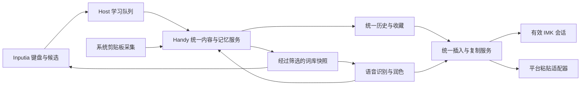

# Handy / Inputia 三能力融合设计与实施计划

状态：设计提案，供实施评审；本轮只完成规划，尚未开始产品改造。
编制时间：2026-09-05 07:42 +0800（北京时间）。
用户目标：让系统输入法、语音转文字、剪贴板历史成为一个连贯的输入产品。

## 1. 产品决定

Handy 是统一控制中心，Inputia 是系统输入法入口。键盘、语音、历史召回共享目标输入框、内容身份、常用词和隐私策略。保留既有品牌、bundle ID 和数据路径，避免在融合过程中同时做品牌迁移。

第一版以 macOS 的完整体验为验收对象；共享数据层不依赖 macOS，Windows/Linux 的现有语音与剪贴板功能保持可构建、可运行，不在本计划中新增系统输入法 Host。

用户感知到的变化：

1. 在任何可输入的位置，既可以打字，也可以说话，也可以调出同一份历史素材并插入。
2. 刚说完的内容立即能在历史面板找到，带有语音标识和可选录音回放；不需要再复制一次才能进入召回列表。
3. 输入法中确认使用的词、用户纠正并保存的术语，可以同时改善候选排序和本地语音识别。
4. 所有设置从 Handy 管理；Inputia 菜单打开对应设置页，显示同一份状态。
5. Handy 退出、模型加载失败或服务短暂失联时，Inputia 的普通打字照常工作。

“融合完成”按上述行为和第 10 节的验收案例判断。入口合并、单测通过或能够启动另一个应用，均不能单独作为完成证据。

## 2. 当前证据与实施底座

本次检查的当前工作区为 `/Users/lzl/FILE/github/Handy`，分支 `codex/funasr-sherpa-native-hotwords`，HEAD `faea17d3864d3d66b4f29c693506a0c81ba5240e`，含 40 个已修改/未跟踪状态条目。不能用本计划覆盖这些已有工作。

另外核实 `/Users/lzl/FILE/github/Handy-upstream-reintegration` 当前为干净工作区，分支 `codex/upstream-first-reintegration`，HEAD `b7d7db70`。该分支已有剪贴板原生交互及快捷键重叠修复。此前的 [上游重接设计](./2026-09-02-upstream-first-reintegration-design.md) 明确要求保留上游协调器、粘贴和数据迁移边界。

实施默认从复核后的上游重接基线创建独立 `codex/unified-input-system` 工作区；开始时重新检查分支和能力差异，保留 FunASR/Sherpa、原生热词、本地纠错、Inputia 及文件剪贴板能力。此处引用旧工作区用于定位问题，不以旧实现覆盖新底座。

源码事实：

- [Inputia 菜单](../../macos/InputiaInputMethod/Sources/InputiaInputMethod/main.swift#L149) 独立提供语音启动、手动同步、剪贴板召回、设置。
- [语音启动器](../../macos/InputiaInputMethod/Sources/InputiaInputMethod/InputiaVoiceInputLauncher.swift#L78) 依赖启动参数和固定等待；已运行分支同步等待子进程退出，不能直接扩展成实时会话协议。
- [记忆导入](../../crates/inputia-core/src/lib.rs#L578) 使用时间升序加数量上限，没有来源记录 ID、版本或删除游标；[learn](../../crates/inputia-core/src/lib.rs#L535) 每次调用累加计数。
- [热词接口](../../crates/inputia-core/src/lib.rs#L501) 返回整条记忆文本；Handy 当前 [转写配置](../../src-tauri/src/managers/transcription.rs#L1232) 消费自己的 `custom_words`。两端尚未形成反向学习通道。
- [语音完成](../../src-tauri/src/actions.rs#L864) 先依赖 WAV 成功保存历史，再触发 paste；成功文字的保留不应继续依赖音频写盘成功。
- [剪贴板浮窗](../../src/overlay/clipboard/ClipboardOverlay.tsx#L330) 确认调用 copy；[输入法召回](../../macos/InputiaInputMethod/Sources/InputiaInputMethod/main.swift#L1016) 直接 insertText；两者动作和结果反馈不同。
- [剪贴板写入](../../src-tauri/src/managers/clipboard.rs#L773) 未填来源 App；[Inputia 隐私检查](../../macos/InputiaInputMethod/Sources/InputiaInputMethod/InputiaRustBridge.swift#L469) 有敏感上下文规则，两端策略不一致。
- [输入法 C API](../../crates/inputia-capi/src/lib.rs#L698) 在生成 commit 时就学习；后续应区分“生成候选结果”与“Host 已调用上屏接口”。
- [导航](../../src/components/Sidebar.tsx#L69) 分开转录历史/剪贴板；[Inputia 设置](../../macos/InputiaInputMethod/Sources/InputiaInputMethod/InputiaRustBridge.swift#L691) 又保存独立文件。

未知项：当前安装 App 是否对应上述基线、真实跨 App 焦点可观测程度、运行时通讯的签名验证可行性、不同模型动态更新热词的能力。这些安排在 P0 的原型和基线验收中确认，不作为已经实现的保证。

## 3. 用户流程与界面

### 3.1 日常输入

输入法候选条继续紧邻光标，只呈现当前拼音、双拼或英文补全结果。语音快捷键沿用用户配置，按键冲突先规范化左右修饰键后统一检测。

录音指示器继续承担短暂状态反馈，不抢输入焦点；仅最终转写进入可复用历史。录音中间文本不持续写入历史，也不自动喂入词库。

Inputia 激活时，语音结果可以通过当前已登记的 IMK 输入会话上屏；使用其他输入源时，统一输出服务调用已有平台粘贴适配器。用户无需选择底层技术路线。

正在组合拼音时启动语音：保留并暂停组合状态。语音完成后若组合仍未结束，结果进入“待插入”，在用户提交或取消组合后再确认插入，不静默丢弃拼音、不把整段语音塞进拼音候选。

### 3.2 统一召回面板

以现有剪贴板浮窗演进为统一召回面板：搜索、来源筛选（全部/语音/复制）、内容类型筛选、收藏、预览。两种原有剪贴板入口访问同一服务和同一排序结果；Inputia 旧召回快捷键作为别名保留，由上下文路由器决定唯一消费者，避免两个面板同时出现。

默认动作明确标注为“插入”：Enter 插入选中内容；方向键移动；Escape 关闭；独立“复制”操作写入系统剪贴板并给出成功反馈。列表单击选择，双击插入，按钮操作不冒泡。搜索框中的 j/k、输入法组合键和快捷键不能被列表导航截获。

兼容已有“单击复制”偏好：升级用户保留原行为，设置中可切换到新交互；新安装使用上述默认。所有确认反馈等待实际结果，失败不能先显示成功再关闭。

图片和文件复用原生剪贴板表示，不转成路径字符串冒充粘贴。当前目标或平台不支持自动插入时，明确显示“仅复制”；系统剪贴板是用户临时交换区，统一历史在 App 内查询，不依赖不断改写系统剪贴板实现同步。

### 3.3 Handy 控制中心

主导航收敛为“历史”“词库”“设置”。历史展示语音及复制内容；语音条目可展开原文、修订版本、录音和重转写操作；词库展示用户词、来源说明、适用范围和“忘记”。模型、语音、输入法、快捷键、隐私、存储作为设置分组。

日常键盘输入默认不生成全文历史，不做跨应用键盘记录。只从 Inputia 已有候选提交、英文完整词、明确收藏和术语纠正中生成必要学习信号。用户显式保存的键入片段才进入统一召回历史。

Inputia 独立设置启动器转到 Handy 对应页面；Handy 不可用时保留轻量离线设置，用同一版本化设置契约。权限按能力申请：剪贴板浏览不强制下载模型或授予麦克风；输入法未安装不阻止语音和历史使用。

### 3.4 两个交付演示

- 复制一个项目名称 → 收藏并选择“加入词库” → Inputia 候选能使用它 → 本地语音会话取得该词提示 → 语音结果出现在同一历史面板 → 选择后直接插入原输入框。整个过程没有手动同步。
- 对一条语音记录进行重转写 → 同一条目生成新版本 → 收藏状态保留 → 原文和新文可比较 → 历史与召回面板同时更新。旧文本不会作为全新复制记录重复出现。

## 4. 架构决定及替代方案

采用“轻量系统 Host + Handy 内统一服务 + 异步本地通讯”。

取舍：

- 多个进程直接写同一个 SQLite 文件：初期少一层服务，但迁移、学习计数、遗忘和焦点状态无统一所有者，也容易把磁盘等待带入按键路径；不作为正式方案。
- 新建独立常驻后台守护进程：能在 Handy 完全退出后继续提供全部功能，但增加安装、权限、升级、崩溃恢复和版本配套成本；第一版不新增第三个长期服务进程。
- 推荐方案：Handy 承担全局内容服务；Inputia 保留 Rime、轻量候选快照和异步学习队列。App 退出时普通输入仍可用，语音/统一历史通过用户触发按需唤起 Handy。

复用 `inputia-core` 的词条与候选概念、`inputia-handy-runtime` 的桥接位置、上游转写协调器和平台粘贴代码。优先在现有 crate 内增加独立模块，避免另起一套输入引擎或自建通用事件总线框架。

## 5. 数据与同步契约

### 5.1 三种数据用途

统一产品不等于把所有内容存进词频表：

- `ContentItem`：可供用户找回的语音、复制、显式保存片段。包含 `item_id`、类型、来源、当前版本、标题、收藏/置顶、时间、附件引用、隐私属性。相同正文可以对应不同来源记录。
- `ContentRevision`：原始转写、纠正、重转写、显式处理的版本，保留 `parent_revision_id` 和操作关系；音频是可选附件。
- `TermContribution`：足以影响候选/热词的最小学习证据，关联源事件和版本；词条分数从贡献聚合，能够撤销。全文历史、历史收藏和词库提升分别是不同动作。

新增 `integration.db` 保存统一索引、修订关系、学习贡献、同步游标和删除标记。现有 history/clipboard 数据库暂时继续由各自 manager 写入；统一服务是 `integration.db` 的唯一写入者。过渡期索引引用旧库记录与附件，不批量复制正文制造额外明文副本。

用户在统一 UI 修改旧记录时，请求携带 operation ID 路由到该记录的源 manager；由源事务修改收藏/标题/当前正文/删除状态并写 outbox。索引确认消费后 UI 才表示完全同步，索引消费不能反向触发同一次源修改。源事务成功而索引暂时失败时，重试返回已有操作结果并补消费，不二次改文或累加。

需要保留的历史修订正文唯一存于 `integration.db` 的不可变 revision 记录，当前正文继续存于源库供兼容版本使用；这属于明确的版本保留，不把所有旧正文再复制一份。重转写/编辑先写带操作 ID 的修订准备记录，再由源 manager 幂等提交当前正文及 revision ID，outbox 将修订标为 committed。未完成的准备记录不参与召回和学习，启动时对账完成或撤销。新建显式片段通过剪贴板源 manager 的显式保存 API 落盘，沿用同一路径。

现有 Inputia memory 被迁移为带来源标签的旧记忆；新学习走统一服务，Host 不再修改规范词频。Rime 用户数据仍由 Inputia 拥有，不让 Handy 直接写 Rime userdb。

### 5.2 可靠增量协议

事件至少包含：`event_id`、`origin_instance_id`、`source_store_id`、`source_record_id`、`source_revision`、`operation`、`policy_epoch`、`observed_context`、`correlation_id`。`source_store_id` 持久化区分数据库身份，不能只用可能重用的整数 ID。

1. 语音/剪贴板 manager 在修改源记录的同一数据库事务内写入 outbox，覆盖新增、改文、收藏、置顶、删除和自动清理。
2. 统一服务按源序列消费；唯一约束阻止相同事件重放。索引、贡献、删除标记和消费游标在 `integration.db` 的一个事务内更新。
3. 提交成功后才确认源 outbox；确认丢失可以重放，不重复计数。发现序列缺口或数据库身份变化时执行带删除对账的重建，不能只扫描“更新时间之后”。
4. 同一语音产生的临时剪贴板写入用输出事务 ID 关联并抑制二次采集；内容 hash 仅辅助去重，不能充当事件身份、来源证明或抑制外部同文复制的唯一依据。
5. 初次导入按最新优先分批处理，继续遍历直至指定范围完成；2000 只能是批次/产品选择，不能永久截断。旧数据库扫描使用一致性读视图和起始游标，增量补上扫描期间发生的变更。

### 5.3 输入法离线与热路径

Host 只在内存中完成当前按键/候选计算；通讯、磁盘写入和历史扫描在串行后台工作线程执行。Rust C API 从“生成 commit 即学习”调整为 Host 提交回执驱动，避免取消、失败、重试被算作成功使用。

Host 维护私有、版本化 outbox 和只读候选快照。队列仅含可学习的词/贡献，不排队保存完整按键日志。默认离线队列最多 10000 事件或 5 MB、TTL 24 小时；超限丢弃最旧的未同步学习信号并记录计数，普通上屏不受影响。

个性化快照采用 2 秒租约，由后台连接续期；断线后最多使用至租约到期，随后只用基础 Rime 和未被撤销的独立用户配置，不使用共享个性化快照。冷启动且无法确认最新隐私版本时直接进入此降级。重连先取得策略版本和遗忘标记，再校验队列、发送事件、刷新快照。失联期间的新增学习需再次通过最新策略。

## 6. 语音会话、输出动作与通讯

### 6.1 会话所有权

保留上游 `TranscriptionCoordinator` 作为录音/转写状态的唯一所有者，为三类入口适配明确的 `Start/Stop/Cancel/Status` 请求；不让 IME 和快捷键各自维护第二套录音状态机。

请求包含 `session_id`、`request_id`、输入来源、目标 token、处理选项、词库版本。语音启动器将“启动后固定等 1.5 秒”替换为异步 ready 握手；启动进程成功只能显示“正在准备”，收到 Recording 状态后才显示录音。

### 6.2 统一输出服务

定义 `OutputRequest {operation_id, item_id, revision_id, action, target_token, session_id}`，支持 insert/copy；自动发送、末尾空格等现有语音偏好只作用于原语音场景，不能传染给历史复用。

目标 token 绑定进程实例、Host/controller 实例、激活代数、可获得的输入框/选择区域标识和有效期，不能仅检查同一个 App bundle ID。记录启动语音或打开面板前的目标；提交前在平台适配器重新验证。

- IME 持有有效目标时，以串行命令在主线程调用 IMK insertText，Handy 不再补一次 paste。
- 其他输入源以平台适配器输出；模拟键和剪贴板操作失败会明确报告。能否确认文本实际落入控件由平台能力决定，成功派发不能冒充应用级回执。
- 目标窗口切换、输入框变化、Secure Input、组合状态冲突或不可确认目标时，转为待插入；用户在当前目标再触发插入。不会在转写结束时强行把旧 App 切回前台。
- 准备阶段尚未发生副作用且明确拒绝时可以改选可用适配器；一旦已经派发但回执丢失，状态为 uncertain，禁止超时自动再 paste。
- 输出去重保存 operation ID 和状态。跨崩溃不承诺 exactly-once；验收要求可确认场景最多一次，未知场景不自动重试。
- 恢复剪贴板前检查其代数/变更 token；用户期间复制了新内容时不覆盖它。保留原生文件、图片、多格式表示。

状态：prepared → dispatched → confirmed / failed / uncertain / pending_target。confirm 表示对应适配器能够证明的完成程度；UI 使用“已插入/已派发/待确认”等匹配文案。

### 6.3 本地通讯

P0 默认原型采用用户私有目录中的 Unix domain socket、长度分帧 JSON 和后台收发；接口与传输分离。不通过 argv、共享日志或广播通知传递转写正文。

握手包含协议主次版本、client/server 实例、安装/数据 profile ID、能力位和 policy epoch。服务检查同用户身份、私有目录和端点归属；P0 验证 macOS 对端进程身份/代码签名约束的可实现性，成功后固定认证方案。开发构建的例外需显式设置且不进入发行默认。

控制帧上限 256 KiB，附件只传受管引用；默认握手超时 2 秒、冷启动准备上限 15 秒，超时仅报准备失败。自动重连指数退避并限流；不依赖前端窗口存活。任意路径读取、任意命令执行都不属于协议。

## 7. 学习与隐私

### 7.1 学习条件

输入法选择的完整词、显式用户词优先；用户纠正语音后选择“记住这个词”形成稳定术语。反复出现的短语可成为建议，但未经确认的 ASR 输出不能自动获得高权重，避免误识别持续强化。

默认自动词条限定为 2–32 个 Unicode 字符的词/短语，过滤孤立按键、控制字符、疑似 token/密码/验证码、长段落和文件路径。中文边界优先采用引擎候选和明确纠正结果；无法可靠抽取时只展示为可确认建议，不用简单截断全文生成热词。

热词合并优先级：显式用户词 → 已确认纠正词 → 允许的本地学习词。去重、按模型能力限制数量和字节预算、按会话固定版本。新增学习词默认最多 64 项、UTF-8 总量最多 4 KiB，并服从更严格的 backend 上限；显式词不静默丢弃，超限在设置解释。

自动学习词只进入 backend 支持的提示/偏置通道，不自动并入当前 `apply_custom_words` 的模糊替换集合。词库版本在正常会话内保持稳定；删除、忘记或隐私撤销发生时必须立即作废被撤销条目，尚未派发的解码以过滤后的提示开始，已运行任务标记该版本失效，结果不得再学习被撤销内容。

模型不支持热词时仅提供已有纠错能力，不能伪称识别阶段已经受益。模型是否需要 reload、是否能在每次 decode 更新提示，在 P0 验证并在 adapter 明确表达；不得为每次词库更新重新下载或重建模型。

### 7.2 隐私规则的所有权

统一 `PrivacyPolicy` 区分 capture（采集）、retain（保留历史）、learn（学习）、remote_use（发送给远程处理）、output（输出）五种决定。保存历史不等于同意模型学习或远程发送。

现有开关迁移按各自原有语义保留，不能把“暂停学习”错误解释成“停止剪贴板使用”。新增跨能力学习有清楚的启用说明；用户已经关闭学习的配置继续关闭。所有生产日志去掉正文、候选文本和窗口标题，诊断只记录匿名 ID、耗时、数量及错误码。

来源 App 与目标 App 分开记录；前台 App 只是观测线索，不能当作剪贴板来源证明。检查系统提供的敏感/临时剪贴板标记及来源可信度。敏感标记或明确敏感场景下不自动持久化、不学习。无法证明来源时标记 unknown，绝不回填成 Handy 或当前输入目标。

普通历史模式继承用户已启用的剪贴板采集授权：unknown 来源且未发现敏感标记/敏感场景时，可以进入本地历史，但不自动学习、不进入远程上下文，并显示“来源未知”。这不保证能够识别一切敏感复制；严格模式拒绝所有 unknown 自动入库，提供“本次未收录：来源无法确认”和显式保存入口。两种模式与学习开关分开。P0 对常见 App 和三类资源实测来源覆盖率；明确记录局限后才启用采集策略，不把前台窗口观察宣传成可靠来源识别。

隐私判定覆盖读取端：敏感/未知输入目标下禁用个性化候选和学习词提示，不自动弹出历史召回；普通 Rime 基础候选按安全直通规则处理。普通历史模式保留 unknown 来源的条目不等于允许 unknown 输入目标读取个性化数据。

本地词库快照不自动拼入远程后处理提示。现有远程转写/润色选择继续只处理用户明确启用的文本；向远程服务发送学习词需独立授权和可见范围。

### 7.3 删除、忘记及策略变更

- 删除历史：删除统一条目及来源映射，撤销由它贡献的学习分数；音频/附件按独立选择和引用计数处理。另一条合法记录贡献的同词分数可保留。
- 忘记词语：删除所有该词贡献，刷新各消费者快照，并阻止旧队列/旧导入复活它；新的显式“加入词库”才能解除此阻止。
- 自动历史过期：移除对应学习贡献；独立由用户确认的词库项按词库规则保留。音频单独过期不删除文本。
- 暂停学习：停止新贡献，旧词仍可用；清空学习：先作全局撤销，再刷新缓存，并拒绝旧 epoch 写入。
- 旧 Inputia 聚合词频没有完整来源映射，迁移标为 legacy；新系统不能声称能够精准撤销每一条旧记录的贡献。对无法追溯的学习提供整体重置重建，保留显式用户词。

离线 Host 重连前必须先应用 forget/policy barrier；清空词库涉及跨进程快照时，UI 显示“已清空服务端，输入法同步中”，直到回执后才显示全部完成。旧备份可能含被删数据；回滚/恢复必须重新应用最新删除账本，不能宣称操作系统层面的安全擦除。

服务端在策略事务提交后立即拒绝旧事件与新快照请求；在线 Host 收到撤销后清除缓存，离线 Host 最晚在 2 秒租约到期后停止使用共享个性化。超过此时间未收到回执显示“输入法离线，个性化已到期”，不能表示已验证清除了离线磁盘缓存。基础引擎用户词典的遗忘状态另按下述 Rime 规则呈现。

忘记不删除基础词典中的合法候选，但须清除该词的个性化加权。Rime 自有学习由 Host 负责：P0 核对词级移除接口，支持时在同一忘记操作中处理；不支持时提供明确的“重置 Rime 学习”独立操作，并在完成前标出 Rime 个性化尚未清除，不承诺“所有输入引擎已忘记”。删除标记不保存原文，使用受本地密钥保护的稳定词标识；落后消费者越过标记保留边界时必须重建快照而非继续旧游标。

## 8. 迁移与退出方案

1. P0 核对旧工作区、上游重接工作区和安装版本；建立“能力已保留/待移植/不适用”清单。
2. 在数据库副本上执行 schema 迁移；真实切换前暂停相关写入，使用 SQLite 一致性备份，覆盖 WAV、文件/图片引用、Inputia 配置、Rime 和 WAL 内容。
3. 建立稳定记录映射；语音 saved 映射为收藏，剪贴板 favorite/pinned/title 保留。相同正文不直接合并不同来源记录；只有可证明的输出关联可折叠展示。
4. 先影子构建统一索引，再对账：所有可见记录、收藏、置顶、标题、正文、附件引用一致；重复迁移不增加词频和条目。
5. 新开关依次启用统一历史、后台同步、会话输出、共享热词；每项独立可回退。旧输入法二进制只写旧数据，不接受新 profile，禁止新旧 schema 混写。
6. 退出新模式时，先停止同步/输出，再切回旧入口；新记录优先仍保存在现有源 manager，避免回退损失文本。新增独立词库和修订写入保留导出。
7. 回滚保留切换后新增记录及最新 forget/delete 账本，再恢复兼容版本。不能直接把旧备份覆盖现库而丢掉新内容或恢复已忘记信息。

唯一受支持的产品回滚目标为 P1 产出的兼容构建 `unified-input-compat-v1`（实际提交在 P1 锁定）：保留旧交互，但认识 outbox、profile、删除屏蔽和修订读取。新模式关闭后，当前正文已在源库可读；历史修订在兼容的记录详情页可读；显式词按稳定 ID 导出/回灌；旧 memory 聚合需先剔除撤销项。兼容构建的旧导入入口也检查屏蔽账本。`b7d7db70` 及更早未经此适配的安装包不属于无损回滚目标，只能在隔离数据副本中作恢复参考。P1 若未能产出该兼容版本，不允许真实数据切换。

## 9. 实施顺序、范围与每阶段交付

### P0：锁定底座和验证跨进程契约

范围：现有上游重接 worktree、`transcription_coordinator.rs`、`clipboard.rs`、Inputia Host/VoiceInputLauncher；新增隔离原型和契约测试。

交付：固定基线提交与能力清单；验证本地通讯 ready/status、同用户进程认证、IMK 目标 token、热词更新能力、剪贴板完整恢复、来源识别覆盖率和 Rime 个性化撤销能力。测试只用合成输入框和测试文本。

验收：在 TextEdit、浏览器 textarea、Electron 编辑器各验证一次有效 IMK 目标和失效目标；100 次连接/断开不阻塞输入；冻结 operation/target/event/policy schema 和降级规则。无法观察焦点的控件明确进入手动插入模式。

### P1：建立统一内容、隐私和可迁移索引

范围：`inputia-core` 新增事件/贡献/策略模块，`inputia-handy-runtime` 承担索引与迁移，Handy history/clipboard manager 增加事务 outbox 和来源判定。

交付：`integration.db`、稳定记录映射、增量处理、删除/遗忘账本、影子历史查询；文本成功不再依赖 WAV 保存。

验收：50000 条合成混合记录全量导入；重跑 3 次记录数和词频不变；中断后续传无遗漏；修改/删除/自动清理传播；同正文不同来源能区分；WAV 写入失败仍保留成功文本；源修改成功而索引失败后重试能够恢复；兼容回滚构建具备修订查看和删除屏蔽能力。

### P2：交付第一个可用融合版本——统一召回和插入

范围：`src/components/Sidebar.tsx`、history/clipboard 视图、`src/stores/clipboardStore.ts`、浮窗与 commands、平台输出适配器；新增共享历史 store，替代重复查询实现。

交付：语音和复制记录在同一面板搜索、收藏、预览并插入；目标恢复/验证、copy 与 insert 独立动作，保留旧点击行为迁移选项。浮窗与主窗口共享后端订阅契约，前端 store 按各 webview 独立实例处理。

验收：语音结束后不触碰系统剪贴板也能被召回；同一内部输出不重复出现；图片/文件按原生格式复制；成功、失败、pending_target、uncertain 文案和行为一致；Escape、搜索输入与组合输入不互相拦截。

### P3：接入 Inputia 会话与异步记忆

范围：Inputia `main.swift`、`InputiaRustBridge.swift`、`InputiaVoiceInputLauncher.swift`、C API、runtime 通讯适配器、Handy coordinator 接口。

交付：Host 连接握手、会话启动/停止/取消、Host 单一输出所有权、词库快照、异步本地学习 outbox、断线恢复；自动同步替代手动重复导入。

验收：重复事件、重复 Start、ACK 丢失、Host/Handy 重启均不二次插入；焦点切到另一 App 或同 App 的另一输入框时不误写；Handy 完全退出仍可进行拼音/双拼输入，旧组合内容不会被语音启动清除。

### P4：打通共同词库和语音质量验证

范围：`inputia-core` 词条提取/贡献、Handy `managers/transcription.rs`、`native_hotwords.rs` 和已有模型能力配置、词库设置页。

交付：显式术语、候选学习、纠正学习；模型会话读取统一快照；用户可查看来源与忘记；本地词不意外发往远程。

验收：完成第 3.4 节的双向演示；超过长度/数量预算、有控制符或敏感模式的内容不能进入提示；不支持热词的模型显示能力状态。固定中文/中英混合测试音频对比前后专名召回、总体 CER/WER 和未说词插入情况。

### P5：统一设置、安装与升级体验

范围：App onboarding、Sidebar/settings、InputiaSettingsWindow、settings crate、Host 构建/设置启动器/安装脚本。

交付：Handy 集中设置，Inputia 菜单深链接，能力状态与版本兼容提示，统一快捷键冲突检测。普通安装用户只有一个日常控制中心；IME 仍按系统要求独立注册。

验收：无需麦克风和模型即可使用历史；输入法安装/未安装/协议过旧三种状态有明确入口；设置离线修改以版本 CAS 合并，冲突不覆盖；两侧更新先验证协议兼容再切换。

### P6：全链路验收与分批启用

范围：前后端门禁、Inputia 非 GUI/GUI 契约、升级副本演练、打包与回滚。

交付：可安装候选版本、验收报告、跨 App 演示、数据对账、回滚演练。所有 P0–P5 验收通过才称“三能力融合完成”。

依赖顺序：P0 → P1 → P2 → P3 → P4 → P5 → P6。P1 契约冻结后，P2 界面与 P3 Host 可分工开发，但按该顺序集成；独立评审重点检查输出所有权和删除/遗忘。

## 10. 总体验收与量化门槛

以下均为设计验收目标，不是本轮已测成绩。基准环境固定为用户这台 Mac，并记录芯片、内存、OS、模型、样本和日志版本。

- A01：输入法确认新术语 → 本地词库 → 下一语音会话 → 统一历史 → 原输入框插入；不需要手动同步。
- A02：历史收藏、置顶、标题修改、语音修订，在主窗口与浮窗的 2 秒内一致；内部重复 copy 不产生第二条语音条目。
- A03：同步重放 3 次、5000 条以上旧数据、源库重建、游标丢失、进程中途崩溃，无重复计数、无静默丢记录。
- A04：明确成功的输出在 100 轮重复/丢包注入中只插入一次；未知回执不自动重放。测试同时覆盖键盘长按和左右 Option/Shift 重叠。
- A05：目标改变、窗口关闭、同 App 输入框切换、组合输入未结束，结果留在待插入，不写入错误位置。
- A06：剪贴板原有文本/图片/文件/多格式保留；输出期间用户再次复制时，不覆盖新内容。
- A07：密码管理器、Secure Input、隐私窗口、未知来源、标记为敏感的剪贴板内容不形成新持久化学习；日志和远程请求不含未授权词库。普通模式的合法 unknown 复制可查，严格模式未收录有明确反馈；不会静默关闭普通剪贴板使用。
- A08：删除源记录撤销其贡献；忘记后离线队列和导入重放不能复活；已有其他合法贡献的同词按定义保留；服务端新 epoch 立即拒绝旧贡献。Host 持续断线时，2 秒快照租约到期不再使用旧共享个性化；Rime 撤销状态不冒充成功。
- A09：Handy/通讯不可用时，Inputia 普通全拼、双拼、Shift、标点与候选翻页仍可用；本轮接入增加的按键处理 p95 ≤ 5 ms、p99 ≤ 15 ms（对比相同 Rime 基线，10000 次回放）。
- A10：50000 条历史中，热启动面板可交互 p95 ≤ 200 ms、搜索服务响应 p95 ≤ 100 ms、在线事件到各投影 p95 ≤ 1 秒（200 次查询、500 次事件）。冷启动/模型加载单独报表，不冒充热启动成绩。
- A11：固定至少 60 段含已确认术语、40 段无术语的合成/许可音频；热词组专名正确率提高，普通组 CER/WER 绝对恶化不超过 1 个百分点，指定“未说术语”反例不得插入该词。未达到时缩减学习热词策略，不能用接口调用成功替代质量验收。
- A12：新装、旧库升级、第二次迁移、切换后新增内容再回滚至兼容构建均对账通过；收藏、置顶、标题、附件和显式用户词无损；兼容 Host 启动、执行旧导入、再次重启不能复活已忘记词；重转写后的旧修订仍可查看。

测试分层：

- 单元：词条过滤、贡献撤销、版本去重、策略判定、目标过期、动作状态机。
- 集成：事务 outbox、消费崩溃、双库一致性恢复、socket 握手/认证/超时、升级兼容、跨窗口事件订阅。
- UI：Playwright 使用可控后端事件验证面板动作和错误反馈；不能把浏览器 mock 测试作为 IMK/系统粘贴成功证明。
- 原生：TextEdit、浏览器 textarea、Electron 编辑器；每个至少 20 轮键入/语音/召回和 10 轮焦点变化；Spaces、重启、剪贴板恢复单列。
- 构建：前端 lint、format、翻译、build、Playwright；Handy Rust test/clippy；Inputia Core/Runtime/Settings/Rime/CAPI test 与 Host 自检；实际执行命令按 P0 固定底座的工具链和 CI 配置锁定。

## 11. 三个重点失败场景与处理

1. IME 上屏后回执丢失，Handy 补 paste 导致双写：同一会话只有一个输出所有者；副作用派发后禁止自动换路线，保留 uncertain 记录供用户判断。
2. 数据越用越“聪明”但实际是误识别全文反复导入：幂等源事件、可撤销贡献、明确的术语条件、固定离线 ASR 评测共同约束。
3. 统一服务退出让所有输入失灵，或忘记数据后离线 Host 又同步回来：Rime 基础输入独立运行；有界异步队列；重连先执行 policy/forget barrier，再处理任何旧贡献。

## 12. 交付边界与后续

本计划包括产品交互、数据合同、模块范围、迁移、失败处理及验收设计。P0 原型解决具体平台机制后按已定契约开发，不需要用户逐个决定接口名称、表名或线程实现。

暂缓：云端跨设备同步、全局逐键记录、OCR、语义向量搜索、自动润色所有剪贴板内容、重写输入法引擎、品牌改名。这些不是完成本次三能力融合的前提。

计划经用户指令进入实施时，再按 `plan-to-codex-plans` 约定复制为正式执行基线并追加执行时间记录；本次不追加已执行条目，不把设计评审等同于产品验收。

## 13. 独立评审修订

已根据独立审查补齐四个合同：统一 UI 写入路由与修订唯一存储、unknown 来源的普通/严格采集模式、唯一受支持的兼容回滚构建、离线个性化快照租约。同步纳入 Rime 个性化遗忘边界和自动词禁止进入模糊替换的约束。
